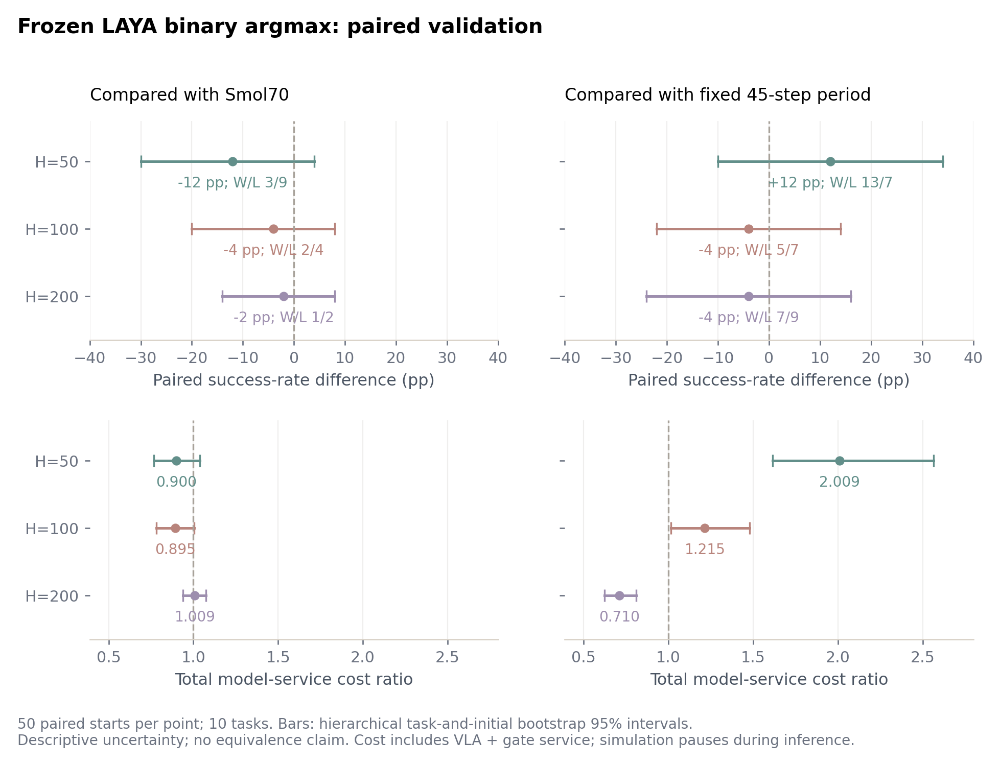
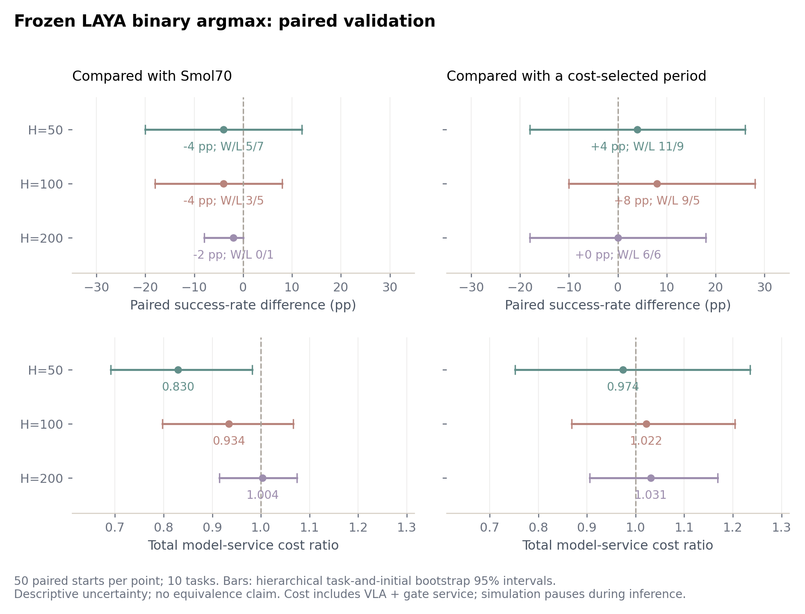
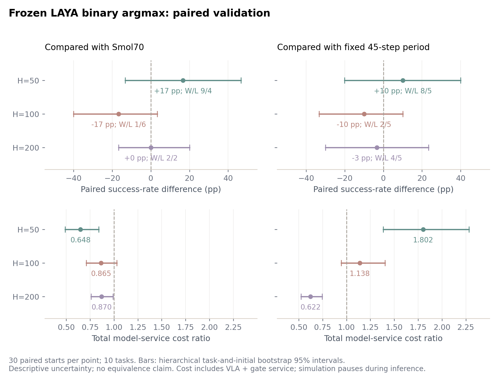
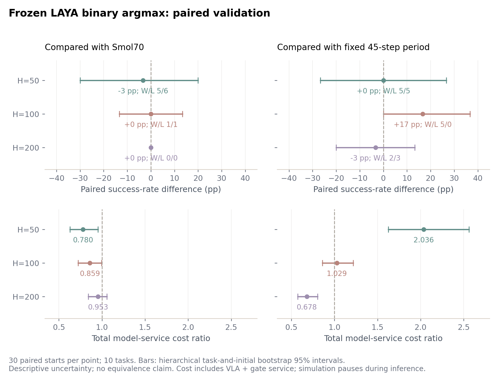
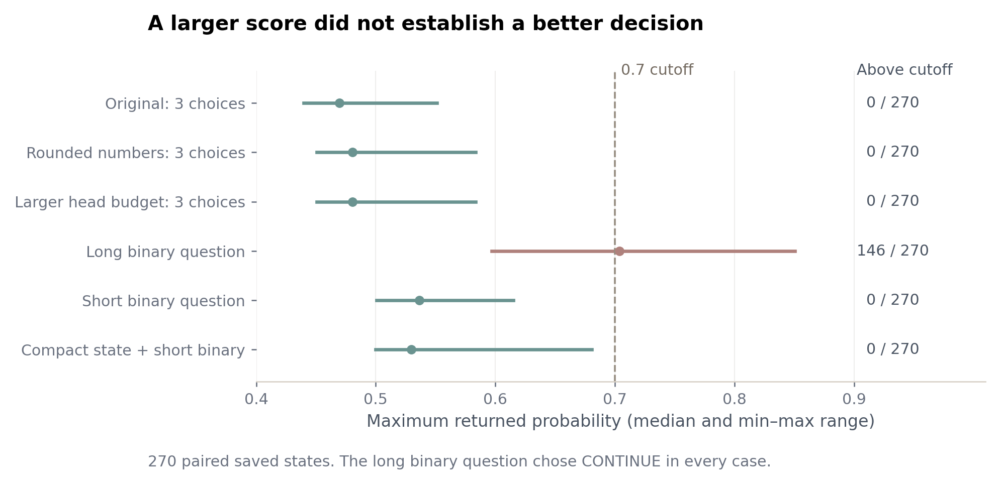
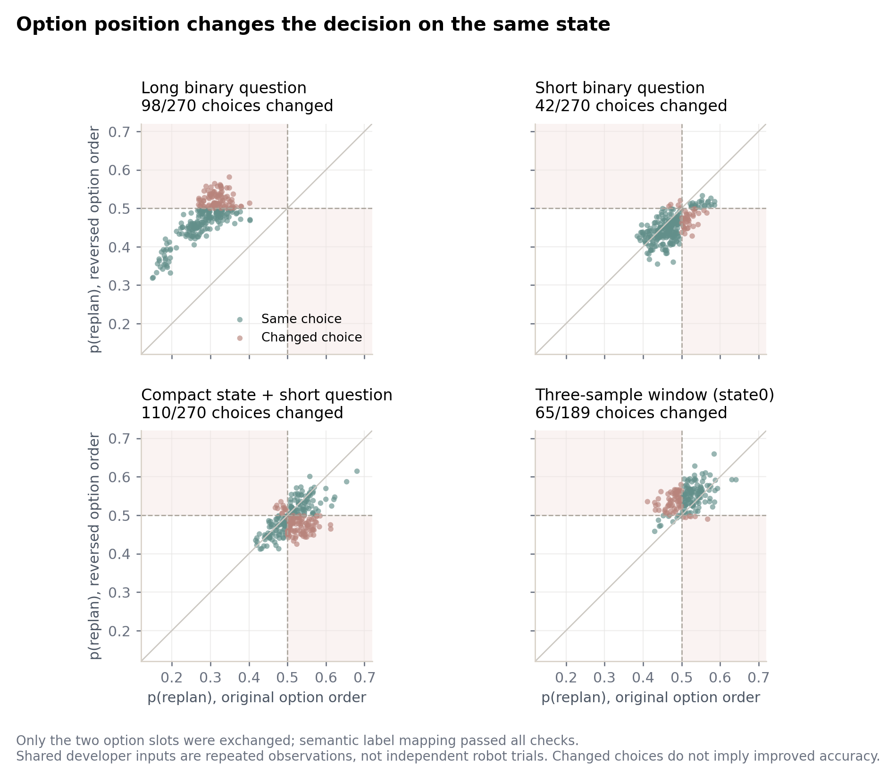
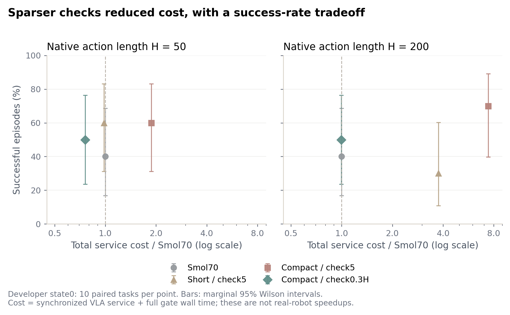
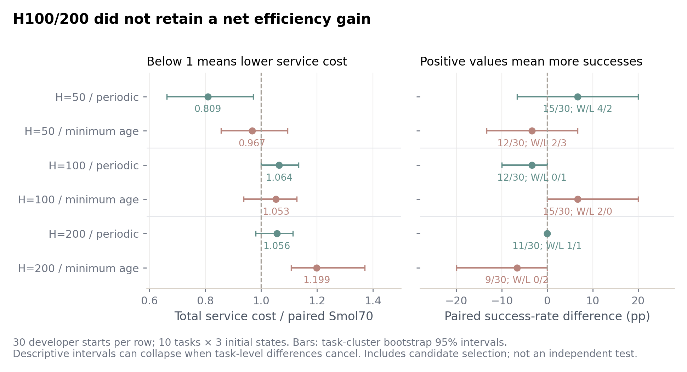
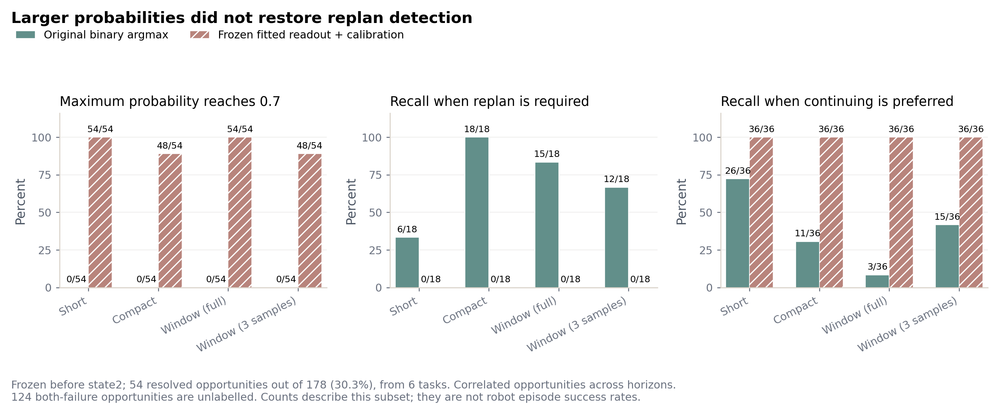
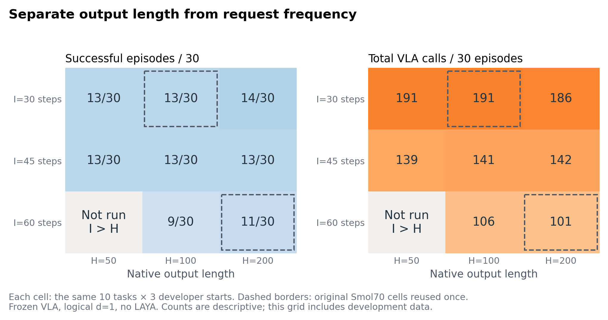

# LAYA 阈值诊断与长动作块优化补充报告

**本轮记录包括诊断、开发、完整配对验证和未完成组的部分样本。** 原长动作块实验作为基线，本报告单独记录新增实验。完整验证共2550个方法／H回合；输入对齐组保留619条记录，其中420条完整且审计通过的记录纳入部分描述，199条中止分片记录单列；随机对照未启动。

## 本版覆盖范围

| 实验部分 | 完成情况 | 本版报告口径 |
|---|---|---|
| 主验证，H50/100/200 |1,050/1,050回合|完整结果，50个配对起点/有效单元|
| 费用接近固定周期对照 |600/600回合|完整结果，50个配对起点/单元|
| 4步逻辑延迟 |450/450回合|完整结果，30个配对起点/单元|
| 5步逻辑延迟 |450/450回合|完整结果，与4步组相同起点|
| 输入、动作行和噪声对齐 |619条记录/计划630回合|前两片420条作部分描述；中止片199条单独保留|
| 随机跳过对照 |0/计划450回合|未启动，资格计划也未执行|
| 官方VLASH π0.5参考 |前轮30/30回合完成且成功|只读复用，模型及批量执行不同|

四批完整验证合计2,550个方法/H回合，不能理解为2,550个独立初态。另有780个开发闭环回合、564个反事实机会/1,128条分支，以及离线概率与选项顺序诊断，分别报告；输入对齐的部分样本不混入完整验证结果。d4/d5共享起点。执行状态及归档证据见[证据清单](analysis/run_inventory.md)。

## 结论

低置信度不是概率字段读取错误。已确认并修复一个输入问题：float32动作本应保留三位小数，却被序列化成十几位，增加约176个token。修复后仍不能可靠越过0.7。扩大提示词预算也无效，因为原请求实际上没有被截断。

按用户授权，后续策略已经改为 **“继续／重规划”严格二选项，取概率较大者**，不再用0.7将全部输出变成弃权。直接使用长版二选项虽会提高分数，却在270条重放状态和20条闭环轨迹中全部选“继续”，不具备有效门控证据。短版与紧凑版能作出不同选择，必须由闭环成功率和完整费用评估。

前轮所谓“原3选项”是服务提示词额外设置了uncertain，并非LAYA固有的输出类别。这个模板差异已单独对照，不能归咎于模型必然有第三类。

**完整主验证没有复现开发阶段的优势。** 冻结三样本窗口＋每计划最多跳过一次的LAYA，在H50/100/200分别成功26/18/16个回合，同批Smol70为32/20/17（各50回合）；完整模型服务费用比为0.900/0.895/1.009。H50/100点估计节省约10%，但分别少成功6/2回合；H200少成功1回合且费用略高。三组费用比的分层95%区间均包含1，不能据此宣称保持成功率或稳定净收益。

固定45步请求在主验证三H成功20/20/18，LAYA相对它的费用比为2.009/1.215/0.710。H50属于更高成功数、同时更高费用的折中；H100点估计更贵且少成功2回合；H200更便宜但也少成功2回合。**目前不能把相对Smol70的节省直接归功于LAYA，也没有输出长度本身越长越好的证据。** 费用接近对照中，LAYA在H50/100比固定周期多成功2/4回合，但区间仍包含零差异；H200没有优势。

4步逻辑延迟的450回合提供了条件性的有利点估计：LAYA在H50成功17/30，对照Smol70为12/30，完整费用比0.648；但H100少成功5回合。相同起点的5步延迟450回合中，LAYA成功13/18/12，对照14/18/12，费用比0.780/0.859/0.953。H100的费用点估计较好，成功差区间仍宽；H50在4步下的成功数优势未保持。整体表现依赖执行条件，尚不能推广成稳定优势。输入对齐未完成原定630回合，随机对照未启动；其完成范围和限制在第8节单列，没有根据已读结果更换候选。

预先登记的564个请求机会、1,128条真实分支均已完成；每个重规划分支逐动作、物理状态复现旧Smol70。state0拟合、state1选择后冻结的校准与线性读出，在state2仍未解决重规划识别：选中线性读出漏掉全部18个需要重规划的有判定机会。未将这些模型部署。确认阶段始终保持原始二项argmax候选冻结，未按结果追加调参。

## 完整配对主验证：1,050回合

task0–9与state10–14共50个起点；每个有效方法/H单元都覆盖全部50个起点，共21个单元。模型、输入、周期、种子及执行顺序均在开始前冻结。以下为统一v2版本的完整结果，不包含旧版420次技术尝试或任何开发/资格回合。表内费用是50回合累计VLA＋门控同步服务秒。

| 方法 | H50：成功/50；服务秒 | H100：成功/50；服务秒 | H200：成功/50；服务秒 |
|---|---:|---:|---:|
| Smol70 |32；102.832|20；62.618|17；33.200|
| 固定I45 |20；46.083|20；46.099|18；47.188|
| 普通K5 |31；300.743|32；302.147|26；324.707|
| 同模型VLASH式K5 |33；285.494|28；310.122|34；284.819|
| LAYA三样本窗口 |26；92.572|18；56.017|16；33.507|
| LAYA紧凑输入 |25；96.050|21；63.355|16；35.160|

主LAYA三H的VLA调用为428/260/157，Smol70为526/321/169；同时增加393/224/114次LAYA调用，门控时间8.228/4.683/2.584秒。减少VLA调用并不必然减少完整费用，H200尤其如此。辅助候选也全部保留：仅首次门控H50/100成功29/18、费用比Smol70为1.016/0.985；最短0.3H后每5步检查的紧凑候选H100成功21、费用比1.083。没有在这批结果中重新选择主候选。

H200的VLA服务减少2.277秒，却增加2.584秒LAYA服务，净增加0.307秒。完整结果读出后进行的一项事后实现诊断显示：三H从未选择继续的回合分别为9/19/36，它们的全部执行动作、物理轨迹、预测块和请求时刻均与Smol70逐值一致；全部150对在首次继续选择最早影响执行之前的动作/物理前缀也一致，没有发现提前分化异常。H200仅14/50回合曾选择继续，共16次，因此多数回合只增加门控开销。该诊断不为单次门控提供因果标签，也不重选策略，详见[事后核对说明](POSTHOC_GATE_TRACE_AUDIT.md)、[全部150对记录](checks/validation_d1_v2_gate_trace_equivalence.json)。

主LAYA相对Smol70配对胜/负为3/9、2/4、1/2；成功率差为−12、−4、−2个百分点，任务＋初态分层95%区间分别为[−30,+4]、[−20,+8]、[−14,+8]。费用比区间为[0.766,1.038]、[0.781,1.005]、[0.938,1.073]。这些区间描述有限任务/初态的不确定性，不能证明等效、不劣或普遍退化。

**长度归因：** 固定I45时，H100相对H50是20对20成功、配对1胜1负；H200相对H50是18对20、1胜3负。相应费用比约1.000和1.024；成功差区间为[−6,+6]和[−14,+6]个百分点。固定请求周期后，没有观察到增大原生输出长度带来的稳定收益。Smol70与LAYA的周期也随H变化，不能将其跨H差异全部归因于动作块长度。

**计时敏感性：** 使用事先固定的开发单价重新核算，主LAYA对Smol70的费用比为0.897/0.888/1.004，与实测方向接近；H100该敏感性区间为[0.777,0.996]，但它没有消除成功回合减少的问题。H50实测费用比可拆为轨迹步数1.107倍×每步调用率0.735倍×单次VLA时长1.008倍×门控乘数1.098倍；这是算术核算，不是因果中介结论。

完整21单元、所有对照的配对区间和固定周期跨H结果见[完整数值表](analysis/VALIDATION_READOUT.md)、[主分析原件](analysis/validation_d1_v2_summary.json)、[费用拆分](analysis/validation_d1_v2_service_accounting.json)、[跨H分析](analysis/validation_d1_v2_cross_horizon.json)。这些验证起点未参与本轮候选选择，但无法据此证明整个项目历史上从未曝光。

## 费用接近对照：600回合

另用task0–9、state20–24，共50个起点/方法/H，完整运行600回合。对照周期H50/I19、H100/I38、H200/I71仅按开发数据预先选择，未按主验证或本批结果调整。LAYA相对固定周期的实测总费用点估计分别为0.974/1.022/1.031，确实接近，但不构成费用等效证明。

| H；固定周期 | LAYA成功；对照成功（各50） | LAYA服务秒；对照服务秒 | 费用比 | 配对胜/负 |
|---|---:|---:|---:|---:|
| 50；I19 |26；24|89.981；92.371|0.974|11/9|
| 100；I38 |24；20|55.121；53.942|1.022|9/5|
| 200；I71 |17；17|33.487；32.468|1.031|6/6|

相对上述固定周期，LAYA成功率差为+4/+8/0个百分点，分层95%区间为[−18,+26]、[−10,+28]、[−18,+18]；费用比区间分别为[0.752,1.235]、[0.869,1.204]、[0.906,1.169]。H50/100给出较弱的有利点估计，仍不足以确认状态选择带来稳定收益。H200两者都成功17个，但有6胜6负，不能把相同总数当作逐回合等同。

同批Smol70成功28/26/18，LAYA为26/24/17；LAYA费用比为0.830/0.934/1.004，配对胜/负5/7、3/5、0/1。H50费用比区间[0.692,0.982]低于1，但成功差区间[−20,+12]个百分点，不能声称成功率已保持。固定I45在三H成功21/20/21，跨H仍没有稳定的长度优势。以冻结开发单价复算LAYA对Smol70的费用比为0.825/0.926/1.005，方向一致。

本批与主验证分开报告，不按有利分片挑选或事后合并为更显著的结论。完整12单元和所有配对区间见[完整数值表](analysis/VALIDATION_READOUT.md)、[预算组原件](analysis/budget_validation_d1_v2_summary.json)、[预算组费用核算](analysis/budget_validation_d1_v2_service_accounting.json)、[预算组跨H比较](analysis/budget_validation_d1_v2_cross_horizon.json)。

## 4步逻辑延迟对照：450回合

task0–9、state31/30/32共30个起点，每个方法/H均完整覆盖。以下费用为30回合累计VLA＋门控同步服务秒，逻辑延迟固定d=4；资格回合不计入有效性分母。

| 方法 | H50：成功/30；服务秒 | H100：成功/30；服务秒 | H200：成功/30；服务秒 |
|---|---:|---:|---:|
| Smol70 |12；73.518|15；35.517|13；18.929|
| 固定I45 |14；26.442|13；26.978|14；26.454|
| 普通K5 |22；162.364|21；168.627|23；158.859|
| 同模型VLASH式K5 |18；194.402|17；198.103|16；200.475|
| LAYA三样本窗口 |17；47.649|10；30.713|13；16.466|

LAYA的VLA调用为221/143/78，Smol70为376/182/97；另有202/120/54次LAYA判断，其费用全部计入。相对Smol70，三H配对胜/负为9/4、1/6、2/2，成功率差+16.7/−16.7/0个百分点，分层95%区间为[−13.3,+46.7]、[−40.0,+3.3]、[−16.7,+20.0]。总费用比0.648/0.865/0.870，对应区间[0.489,0.841]、[0.711,1.030]、[0.759,0.988]；固定开发单价复算为0.648/0.859/0.866。H50/H200的费用有利并不能消除成功差的不确定性，H200相同成功总数也不是不劣证明。

固定I45仍是关键对照：LAYA相对它的费用比为1.802/1.138/0.622，配对胜/负8/5、2/5、4/5。H50取得更高成功数的同时增加费用；H100点估计更贵且少成功；H200便宜但少成功1回合。I45的H50与H200在这30个起点的成功标记逐对相同，经验bootstrap因而退化为零差区间；这不证明总体等效或动作轨迹相同。

该批普通K5的成功数比VLASH式K5各多4/4/7，费用也更低。由于两者还同时改变了执行起始行及采样噪声时钟，而且同模型代理没有offset训练，不能把差异只归因于“当前机器人状态有害”。预登记输入对齐对照的实际完成范围见第8节；部分样本不能替代原定完整归因分析。

完整15单元、配对区间和跨H结果见[完整数值表](analysis/VALIDATION_READOUT.md)、[d4分析原件](analysis/delay_validation_d4_v2_summary.json)、[d4费用核算](analysis/delay_validation_d4_v2_service_accounting.json)、[d4跨H比较](analysis/delay_validation_d4_v2_cross_horizon.json)。d4与主d1使用不同初态，不能将两批差异直接解释成延迟的因果效应；d5使用同一批初态，其已登记配对比较列在下文。

## 5步逻辑延迟对照：450回合

仍使用task0–9、state31/30/32，每个方法/H为30个起点，模型、候选与执行顺序保持冻结，仅按预登记将逻辑延迟改为d=5。费用仍为30回合累计模型服务秒。

| 方法 | H50：成功/30；服务秒 | H100：成功/30；服务秒 | H200：成功/30；服务秒 |
|---|---:|---:|---:|
| Smol70 |14；70.105|18；32.422|12；19.477|
| 固定I45 |13；26.845|13；27.056|13；27.381|
| 普通K5 |20；173.263|22；163.689|23；159.230|
| 同模型VLASH式K5 |11；219.967|12；225.592|11；224.745|
| LAYA三样本窗口 |13；54.654|18；27.837|12；18.567|

LAYA三H的VLA调用为253/130/87，Smol70为359/165/99；另增加234/108/61次LAYA判断，费用4.729/2.194/1.378秒，均已纳入总服务费用。LAYA对Smol70费用比0.780/0.859/0.953，分层95%区间为[0.628,0.953]、[0.723,0.994]、[0.842,1.056]；固定开发单价复算为0.778/0.861/0.948。

相对Smol70，三H配对胜/负为5/6、1/1、0/0。成功率差为−3.3/0/0个百分点，区间[−30.0,+20.0]、[−13.3,+13.3]、[0,0]。H100给出成功总数相同、较低费用的有利点估计，但1胜1负及其区间不能证明不劣。H200的30个成功标记逐对相同，经验bootstrap退化，并不证明总体等效或动作轨迹相同。

相对固定I45，LAYA费用比为2.036/1.029/0.678，配对胜/负5/5、5/0、2/3。H100多成功5回合，成功差区间[0,+36.7]个百分点，费用比区间[0.860,1.216]；它是当前条件下有利的描述性结果，不作为改选候选或优胜部署的依据。I45在三H均成功13/30且成功标记逐对相同，仍无原生输出越长本身越好的证据。

同模型VLASH式K5在三H的成功数均低于普通K5、服务费更高；这不是官方offset训练模型的结果。完整数值见[d5分析原件](analysis/delay_validation_d5_v2_summary.json)、[d5费用核算](analysis/delay_validation_d5_v2_service_accounting.json)、[d5跨H比较](analysis/delay_validation_d5_v2_cross_horizon.json)。

## 同起点：延迟从4步变为5步

以下是全部15个预登记比较，d5为候选、d4为参照，各30个配对起点，区间为分层95%描述性区间。比较同时包含观测时序、门控输入和请求时刻变化带来的整个策略响应，不是单独图像延迟或真实异步速度的因果分解。

| 方法 |H | 成功（d5/d4，各30） | 配对胜/负 | 成功差pp [区间] | 总费用比 [区间] |
|---|---:|---:|---:|---:|---:|
| 固定I45 | 50 | 13/14 | 0/1 | -3.3 [-13.3, +0.0] | 1.015 [0.985, 1.087] |
| 固定I45 | 100 | 13/13 | 1/1 | +0.0 [-13.3, +13.3] | 1.003 [0.923, 1.098] |
| 固定I45 | 200 | 13/14 | 0/1 | -3.3 [-13.3, +0.0] | 1.035 [0.993, 1.118] |
| 普通K5 | 50 | 20/22 | 3/5 | -6.7 [-30.0, +16.7] | 1.067 [0.856, 1.352] |
| 普通K5 | 100 | 22/21 | 2/1 | +3.3 [-10.0, +16.7] | 0.971 [0.833, 1.132] |
| 普通K5 | 200 | 23/23 | 3/3 | +0.0 [-20.0, +23.3] | 1.002 [0.803, 1.243] |
| Smol70 | 50 | 14/12 | 2/0 | +6.7 [+0.0, +20.0] | 0.954 [0.857, 1.012] |
| Smol70 | 100 | 18/15 | 4/1 | +10.0 [-6.7, +30.0] | 0.913 [0.792, 1.034] |
| Smol70 | 200 | 12/13 | 1/2 | -3.3 [-16.7, +10.0] | 1.029 [0.978, 1.107] |
| VLASH式K5 | 50 | 11/18 | 1/8 | -23.3 [-46.7, +0.0] | 1.132 [0.965, 1.355] |
| VLASH式K5 | 100 | 12/17 | 1/6 | -16.7 [-36.7, +3.3] | 1.139 [0.999, 1.323] |
| VLASH式K5 | 200 | 11/16 | 1/6 | -16.7 [-36.7, +3.3] | 1.121 [0.992, 1.309] |
| LAYA三样本窗口 | 50 | 13/17 | 2/6 | -13.3 [-36.7, +6.7] | 1.147 [0.991, 1.386] |
| LAYA三样本窗口 | 100 | 18/10 | 8/0 | +26.7 [+6.7, +46.7] | 0.906 [0.782, 1.026] |
| LAYA三样本窗口 | 200 | 12/13 | 3/4 | -3.3 [-26.7, +20.0] | 1.128 [1.044, 1.238] |

LAYA的H100从10/30变为18/30，配对8胜0负，成功差区间[+6.7,+46.7]个百分点；但H50从17降至13，H200从13降至12且费用比1.128。VLASH式在三H均减少成功数；普通K5的变化则有正有负。完整对比显示对时序的敏感性，不能据此作出“增加延迟可以提高成功率”的一般结论，也不按15个比较中的有利结果重新选控制条件。原件见[跨延迟分析](analysis/cross_delay_d5_vs_d4.json)和[事前登记](CROSS_DELAY_ANALYSIS.md)。

## 1. 不变的实验条件与比较口径

- 仅远端RTX4090 D；既有外部GPU进程保留，一次只运行一个自有作业。
- 同一SmolVLA检查点：`HuggingFaceVLA/smolvla_libero@6721902bc4d61e50a3bfdb11dfb4cb626f05d102`。每次预测原生输出H=50/100/200，不复制、拼接或填充50步动作冒充更长输出。H100/200是训练长度50之外的零样本外推。
- VLA全程eval、requires_grad=false、无optimizer；前后权重指纹一致：`b296dfca9e977fbe06d0f4a7971dbcfa368954e168c32f9c61295107f00eba82`。RTC关闭、NFE10、FP32固定噪声，任务与绝对tick的种子映射不变。
- LIBERO Spatial，task0–9；每回合最多230控制步。d=1是逻辑延迟，仿真在推理期间暂停，不是实际异步或真实机器人速度测试。
- LAYA输入含仿真对象坐标、机器人状态、既有动作队列及年龄。坐标是特权观测，未计入真实视觉系统估计它们的费用。
- 总服务费用=VLA同步服务墙钟＋门控端到端墙钟，含主机处理、同步与IPC。资格检查和warmup另记。不同阶段的计时存在运行环境波动，因此同时报告VLA与门控调用次数。

Smol70按`remaining/H <= 0.7`触发，首次在15/30/60步附近请求，即执行约30%后请求。论文的严格小于与当前客户端的小于等于相差一个控制步，本轮固定使用后者；重叠队列使用新块覆盖，未实现论文全部聚合和近重复状态过滤变体。普通K5和VLASH式输入对齐对照沿用前轮实现；同模型VLASH式方法没有额外offset训练，不能称为完整官方VLASH复现。[SmolVLA论文](https://arxiv.org/html/2506.01844v1)、[官方客户端](https://github.com/huggingface/lerobot/blob/main/src/lerobot/async_inference/robot_client.py)、[VLASH论文](https://arxiv.org/html/2512.01031v2)、[固定VLASH代码](https://github.com/mit-han-lab/vlash/blob/d2da223e2251a4a5020b667e77cf8ad57e594144/vlash/eval_libero.py)。

### 1.1 执行环境与统计定义

| 项目 | 固定设置或实际记录 |
|---|---|
| GPU | NVIDIA GeForce RTX 4090 D；同一远端设备，保留既有外部进程 |
| PyTorch／CUDA／cuDNN | 2.9.1+cu128／12.8／cuDNN版本整数91002 |
| 数值后端 | deterministic algorithms=false；cuDNN benchmark=false、deterministic=false；float32 matmul precision=highest；CUBLAS_WORKSPACE_CONFIG未设置 |
| LAYA | SDK 0.3.22；固定模型revision 55cf4c4ebb4ebe31b2550e8bdf3bd21b99753851；本轮未更新基础模型权重 |
| VLA原生动作 | 每次同时设置chunk_size与n_action_steps为H；返回形状严格为H×7；NFE10，RTC关闭 |
| 噪声与配对 | CPU FP32 Gaussian；种子20261007＋task×100000＋state×1000＋预测tick，图像时刻噪声控制按其登记改用图像tick |

环境来自主验证原始manifest（未随仓库提供；见数据说明），原生输出与时钟定义见[冻结执行代码](scripts/controller_runtime.py)。保留原后端是为维持已接受的数值路径，不能推断所有中途预测绝对可重复；第7节单列已知复现边界。

成功率以每个预定起点的一整回合为单位。对候选A与参照B，配对胜指A成功且B失败，负为相反情况，成功差为“(胜−负)/配对起点数”。服务费用比是所有配对回合的A累计模型服务秒除以B累计模型服务秒，不是逐回合费用比的平均值；早停成功会改变轨迹长度，所以另提供总步数、调用率和固定单价核算。模拟器推进、磁盘写盘、启动和资格检查不属于该服务时间，也不能由它推导实际机器人完成任务的加速倍数。

正式组使用预先登记的10,000次配对bootstrap，随机种子20261008：先重采样任务，再在抽中的任务内重采样初态，A/B使用同一抽样，取2.5%与97.5%分位。完整JSON同时保留固定任务、仅重采样初态的敏感性区间及旧task-only口径。所有区间都是描述性不确定性，不是预设不劣界限的检验；多个方法和H没有提供经过多重比较修正的优胜声明。统计实现见[配对重采样源码](scripts/paired_resampling.py)和[开始验证前的统计修订](STATISTICS_AMENDMENT_01.md)。

### 1.2 主LAYA控制器实际怎样决定

冻结主候选是`window3_skip1`。它保留任务文字、计划年龄与剩余长度、当前末端及夹爪状态、对象当前位置及其相对上次请求的位移；从已有动作队列中只显示下一个检查窗口及交付延迟内的三个位置。窗口长度为`L=min(remaining,I+d)`，取偏移`0、floor((L−1)/2)、L−1`，每个位置提供平移命令和夹爪命令，省略旋转。它没有生成未来物理状态，也没有读取后续成功标签。动作值是控制器单位，对象坐标才是米，二者不混用。见[窗口构造](scripts/window_state.py)和[固定问题及输入格式](scripts/gate_variants.py)。

| 原生输出H | 单次检查年龄I=0.3H | 选择重规划R | 选择继续C |
|---|---:|---|---|
| 50 |15步|年龄15请求新块|年龄30强制请求新块|
| 100 |30步|年龄30请求新块|年龄60强制请求新块|
| 200 |60步|年龄60请求新块|年龄120强制请求新块|

计划年龄以该块请求时刻为原点。LAYA只在年龄I问一次，不在等待到2I期间反复投票。请求后仍执行d步旧队列，新块交付时丢弃前d行动作；有限队列将耗尽时保留强制更新保护。例如H100、d4时，初始计划的LAYA检查发生在tick30；R在tick34接入新块，C则到tick60请求、tick64接入。该门控若总选R，调度恢复Smol70；若总选C，则相当于固定0.6H请求，但仍多付门控费用。

问题固定为“现在请求新计划”与“继续到下一次检查”两项，使用SDK返回的二项最大概率选择，精确同分沿用其固定选项顺序。不再要求最大概率≥0.7，也不添加uncertain兜底。VLA和基础LAYA权重均冻结；校准读出只在独立开发分析中拟合，未进入这套控制器。实现及每次判断记录字段见[二项服务](scripts/binary_service.py)。

## 2. 为什么原来达不到阈值

在旧90条开发轨迹中各取首、中、末门控，共270条保存输入。6种变体共1620次机器人状态判断；另有60次人工明确语义控制判断和单列warmup。不是1620个独立机器人起点。

| 变体 | 平均token | 最大概率范围 | ≥0.7/270 | replan/270 | SDK中位墙钟ms |
|---|---:|---:|---:|---:|---:|
| 原3选项 |923.84|0.4395–0.5511|0|165|24.82|
| 仅修复数字格式 |748.34|0.4508–0.5835|0|103|21.79|
| 再扩大head预算 |748.34|0.4508–0.5835|0|103|21.64|
| 长版二选项 |727.34|0.5971–0.8503|146|0|21.53|
| 短版二选项 |662.34|0.5005–0.6151|0|61|19.66|
| 紧凑状态＋短二选项 |441.93|0.5000–0.6806|0|182|16.81|

原3选项270条概率与历史记录逐值相同。SDK由原始logits经过温度缩放和softmax得到概率，我们逐项复算吻合；旧代码也没有把归一化熵confidence误当max(p)。三项和二项使用的温度分别约1.760和1.906，不能靠擅自降低温度制造“校准成功”。

二项时，最大概率为`sigmoid(|logit差| / T)`；T约1.906时，越过0.7需要原始logit差约1.615。紧凑输入本批最高0.6806，对应差约1.442，确实低于所需差值。该阈值失败来自现有评分与输入产生的决策间隔，而不是把输出概率读小了；本轮也没有证据证明0.7可解释为70%的机器人决策正确率。

在完整主验证中，冻结三样本窗口的393/224/114次门控也全部未达到0.7；三H最大返回概率分别为0.6045/0.6402/0.6410，中位数约0.5297/0.5362/0.5362。共731次判断来自150条相关闭环轨迹，不能视为731个独立正确性样本。它说明阈值现象在这批新验证起点仍存在，不证明低分决策必然错误。见[主验证分数分布及逐文件SHA](analysis/validation_d1_v2_score_distribution.json)。

数字格式修复减少了约19%的token，改变86/270个argmax，但没有使任何一条越过0.7。所有变体的head与state截断均为0；“提示词被裁掉”在本批数据上被排除。10条明确语义控制中，原3选项答对9条，二选项答对7条；此小样本不等于机器人决策准确率。

因此，目前能确认的是输入工程问题和对问题表述的敏感性，尚无该机器人任务上的有效置信度校准证据。补齐最早诊断的完整归档后，原6个文件与先前分析版本逐字节一致；1,680条输出的14,000项只读核验零错，softmax与SDK输出最大差仅约0.00005（四位小数舍入）。完整诊断、固定SDK代码及哈希见[DIAGNOSIS.md](DIAGNOSIS.md)与[diagnosis_summary.json](analysis/diagnosis_summary.json)。公开模型说明仅作为实现背景：[固定LAYA模型卡](https://huggingface.co/convaiinnovations/laya/blob/55cf4c4ebb4ebe31b2550e8bdf3bd21b99753851/README.md)。

### 2.1 选项位置敏感性与双顺序负结果

进一步固定1,029条开发输入、问题文字和温度，只交换两个选项的位置，共2,058次判断，另8次warmup。原顺序1,029/1,029复现已有概率和选择；全部槽位logits经独立softmax和语义映射均吻合SDK。不存在把第一个位置错误当作“重规划”的字段问题。

| 输入表示 | 真实状态数 | 换序后改变选择 | 逆序≥0.7 |
|---|---:|---:|---:|
| 长二项 |270|98（36.3%）|0|
| 短二项 |270|42（15.6%）|0|
| 紧凑短二项 |270|110（40.7%）|0|
| 三样本窗口，state0 |189|65（34.4%）|0|

长二项原来146/270跨过0.7且全部选择继续，逆序后变成98次重规划、0次跨阈值。高置信度随排列改变，进一步说明其分数不应直接解释为该机器人决策正确的概率。紧凑与窗口输入也有明显顺序敏感性；逆序没有解决0.7门槛问题。另30条明确语义控制单列，不混入机器人状态或成功率分母。见[完整顺序诊断](analysis/choice_order_audit_v1_summary.json)。

开发层面另测试了固定的双顺序语义logit平均，仍以二项argmax选择，不拟合参数。state0的55个可判定机会中，重规划召回仍为9/9，但平衡准确率从0.663降至0.598；全部189机会的继续选择从69降至31。仅在首次请求做一次判断、随后按Smol70恢复的30条既有完整分支中，成功数由16降至14，VLA调用从195增到208，双次SDK平均34.23毫秒（尚不含部署IPC）。**不部署这一候选**，也不因为AUC从0.716上升到0.768而忽略实际argmax结果变差。这些是对保存分支的开发选择分析，不是新增30个机器人测试回合，不修改已冻结主候选。见[事前推进条件](ORDER_ENSEMBLE_DEVELOPMENT.md)、[分支评价原件](analysis/order_ensemble_state0_development.json)。

## 3. 二选项闭环：高分不等于有效判断

表示pilot：task0–9、state0、H50/200，每种设置每H十回合，共80回合。

| 设置 | H50成功 | H50 VLA调用 | H200成功 | H200 VLA调用 |
|---|---:|---:|---:|---:|
| 配对Smol70旧参照 |4/10|127|4/10|32|
| 队列将耗尽才请求 |5/10|38|1/10|19|
| 长版二选项，每5步检查 |5/10|38|1/10|19|
| 短版二选项，每5步检查 |6/10|74|3/10|58|
| 紧凑二选项，每5步检查 |6/10|187|7/10|188|

长版二选项的20条轨迹与队列耗尽对照逐动作、物理状态完全相同，但增加了755次门控。紧凑二项在H200有更高的开发成功数，同时总服务费用达到Smol70的7.43倍，不能称为推理效率改进。这促使下一轮优先优化检查时机。

## 4. 调度优化：成功与费用必须一起看

调度pilot：同一state0，H50/100/200，4个候选，共120回合。

| 设置 | H50成功；VLA调用 | H100成功；VLA调用 | H200成功；VLA调用 | 总服务费比Smol70：50/100/200 |
|---|---|---|---|---|
| Smol70 |4/10；127|5/10；60|4/10；32|1 / 1 / 1|
| 短版，每0.3H检查 |4/10；56|3/10；37|1/10；21|0.575 / 0.745 / 0.780|
| **紧凑版，每0.3H检查** |**5/10；81**|**5/10；55**|**5/10；29**|**0.759 / 1.037 / 0.995**|
| 紧凑版，最短0.3H，每5步检查 |3/10；94|6/10；50|4/10；32|0.934 / 0.960 / 1.156|
| 紧凑版，最短0.3H，每0.1H检查 |3/10；94|6/10；55|4/10；31|0.925 / 1.027 / 1.097|

“每0.3H检查”按绝对tick的全局周期实现，没有最短计划年龄限制；有限队列强制更新后可能与新计划起点错位。它与“最短执行0.3H”是不同策略。H50时后两组实际上是同一策略，重复结果不增加独立样本量。

图中为开发集点估计及边际Wilson区间；正式比较还记录配对胜/负和task聚类bootstrap。当前10个任务不足以证明等效或普遍优越。紧凑0.3H作为首选进入state1、2确认，最短0.3H＋5步检查作为次选；短版H50和频繁紧凑版H200保留为成功率端参照。

### 4.1 另外两个开发初态的确认结果

160回合确认已完成。以下合并state0–2，每行30回合；该表同时包含用于选择的state0，属于开发总结，不是独立测试。

| 方法 | H | 成功/30 | VLA调用 | 门控次数 | 总服务秒 | 比同H Smol70 | 配对胜/负 |
|---|---:|---:|---:|---:|---:|---:|---:|
| 紧凑，每0.3H检查 |50|15|244|322|57.23|0.809|4/2|
| 紧凑，每0.3H检查 |100|12|176|165|39.81|1.064|0/1|
| 紧凑，每0.3H检查 |200|11|96|71|20.97|1.056|1/1|
| 紧凑，最短0.3H，每5步检查 |50|12|275|518|68.42|0.967|2/3|
| 紧凑，最短0.3H，每5步检查 |100|15|174|183|39.39|1.053|2/0|
| 紧凑，最短0.3H，每5步检查 |200|9|104|103|23.80|1.199|0/2|
| 短版，每5步检查 |50|11|286|1085|92.87|1.313|5/7|
| 紧凑，每5步检查 |200|15|652|978|158.15|7.968|10/6|

紧凑0.3H的服务费用比的task聚类bootstrap 95%区间分别为H50 [0.662,0.972]、H100 [1.000,1.134]、H200 [0.981,1.113]。这些是开发搜索后的描述性区间。H200的少量VLA调用节省没有覆盖门控本身的费用；state0上观察到的成功数优势也未在另外两个初态上保持。H100的最短执行窗口方案有成功数增加、费用约增加5%的折中，仅属于开发证据；该辅助候选在报告前部另列主验证结果。

因此，不将频繁门控或长版高置信分数晋升为主方案。后续工作转向真实分支标签，检验何时应跳过一次请求，而不是继续细扫无标签阈值。数据与所有同模型VLASH配对比较保存在[合并开发总结](analysis/pooled_development.json)。

## 5. 真实分支标签与后续校准

不把整回合成败直接贴给每个门控。新流程从Smol70的真实请求时刻恢复同一状态，分别执行请求和跳过请求；一个旧动作延迟后，重规划分支接入新队列；到下个0.3H机会后两者恢复共同Smol70规则。R分支必须精确复现原基线后缀。

六组资格试验通过372项核验，VLA保持冻结：3组效用偏好continue，1组replan，2组两者都失败而保留无判定。该小样本仅证明流程可用。后续564个机会在运行前固定，按state0训练、state1校准、state2诊断评估，不能随机把同轨迹门控拆到不同集合。详见[COUNTERFACTUAL_PROTOCOL.md](COUNTERFACTUAL_PROTOCOL.md)。标签依赖同一固定噪声实现和指定后续策略，不等于重规划的普遍条件期望价值。

训练组state0已完成，复用上述6组并新增183组；新增9,050项分支核验零错误。189个机会中55个有明确标签（29.1%），其中continue46、replan9。按H50/100/200分别为33/16/6个可判定机会，不能把这些相关请求视为55条独立机器人轨迹，也不能把可判定子集的结果推广到两分支都失败的状态。

三种问题共567次冻结LAYA打分通过6,430项核验，前后LAYA权重SHA为`ae9a05c819a0ab99493067336fd9f5c186dce48265e75ef027978f2597dfac71`。原三项问题条件化到两项的AUROC为0.641，短二项0.546，紧凑二项0.662；均为训练数据上的描述，三者均没有概率达到0.7。紧凑二项在55个可判定机会中预测replan42次，而真实标签仅9次，说明仅改成argmax仍可能过度调用。后续映射与读出实际对比了全局及每H先验，没有仅按多数类准确率晋升。详见[训练组原始分数](analysis/raw_scores_train_summary.json)与[校准协议](CALIBRATION_PROTOCOL.md)。

校准组state1的197个机会也已完成（新增394条分支），9,670项审计零错。46个有判定效用标签，其中continue37、replan9，覆盖率仅23.4%；其余151个为双失败。三种原定表示的591次打分通过6,702项检查，LAYA权重保持不变。窗口表示已与原表示统一完成state1选择，并在state2评价前冻结全部系数。

另增加两个已登记控制：仅基于task×H的常数先验用于排除任务身份记忆；单次跳过请求的调度让每次门控都发生在计划年龄0.3H，避免把该年龄上的标签直接用于任意频率。窗口输入分别测试只调整三个采样位置，以及保留全部动作分量并添加窗口统计；后者若改善，不能仅归因于窗口范围。

### 5.1 校准并未产生可用的新门控

已用state0拟合、state1选择并冻结系数，随后只读评价state2，没有再拟合。三类先验为全局频率、H频率、task×H频率。以下均在state1的46个有判定机会上，实际replan标签9个；读出温度也使用state1，因此表中是开发选择结果。

| 二项输入 | 原始AUROC | 原始NLL | 线性读出＋校准NLL | 读出重规划召回 | 读出≥0.7/46 |
|---|---:|---:|---:|---:|---:|
| 短版 |0.369|0.6626|0.4998|0/9|46|
| 紧凑版 |0.731|0.7035|0.4573|0/9|46|
| 完整窗口 |0.505|0.7389|0.4970|0/9|46|
| 三样本窗口 |0.644|0.6981|0.4780|0/9|43|

按H先验的NLL为0.4600、重规划召回4/9；全局先验NLL为0.4957。紧凑读出虽略改善NLL，却和其余选中读出一样全部选择continue。带截距校准也全部continue。概率变大主要伴随多数类偏移，不能作为有效判断重规划的证据，因此**没有适配模型晋升部署**。冻结定义与字节SHA见[模型清单](models/calibrators_v1/manifest.json)；仍按用户要求保留未经适配的二项argmax。

state2独立诊断包含178个机会、356条分支，8,752项分支检查及890次打分的10,328项检查零错误。54个机会有可判定标签（continue36、replan18），124个双失败仍保留无判定。以下只描述54个可判定机会，覆盖率30.3%，不能推广为整批机器人决策准确率。

| 二项输入 | 原始AUROC | 原始NLL | 原始重规划召回 | 原始继续召回 | 冻结线性读出＋校准NLL | 读出重规划召回 |
|---|---:|---:|---:|---:|---:|---:|
| 短版 |0.497|0.6799|6/18|26/36|0.6815|0/18|
| 紧凑版 |0.596|0.7139|18/18|11/36|0.6718|0/18|
| 完整窗口 |0.589|0.7295|15/18|3/36|0.6761|0/18|
| 三样本窗口 |0.557|0.6958|12/18|15/36|0.7003|0/18|

原始二项输出在这54个机会中均未达到0.7；四种选中线性读出却有约89%–100%的最大概率超过0.7，同时全选continue。紧凑原始argmax能够召回全部18个重规划标签，却多请求了25个本可继续的机会，仍有明显费用代价。训练、校准、诊断分组的可判定标签比例和类别比例变化较大，又仅来自每组10个任务初态，不足以支持可靠概率校准的结论。80项冻结模型定义的原始JSON字节SHA保持`4a08babde47322238f156d7ebcbf99bbba792750b52be90c7679dbc796f33a58`；完整先验、分H结果与task聚类区间见[只读诊断结果](analysis/calibrators_v1_state2_evaluation.json)。

### 5.2 每回合只改变第一次请求：检验潜在空间

这项开发分析每H包含state0/1共20回合，所有双失败回合保留。每回合只在首次Smol70请求机会选择C或R，之后恢复共同Smol70；结果来自已实际执行的所选分支，不把多个干预的收益相加。尚未包含LAYA服务费用。

| 策略 | H50 成功；调用 | H100 成功；调用 | H200 成功；调用 |
|---|---|---|---|
| 原Smol70 |8/20；249|8/20；129|7/20；68|
| 首次请求始终跳过 |9/20；222|8/20；115|2/20；57|
| 原紧凑二项首次argmax |9/20；232|8/20；125|7/20；68|
| 三样本窗口首次argmax |11/20；219|9/20；121|6/20；66|
| 知道未来结果的oracle |11/20；208|10/20；109|8/20；53|

oracle使用未来结果，只作不可部署的上限参照。该表显示H50仍有值得验证的早期决策空间，H200盲目跳过则会明显损失成功率。首次请求门控的6回合实际执行资格测试已完成：1,451项闭环检查和171项分支复现检查零错；实时输入、选择、完整动作与物理轨迹及全部后续VLA动作块均与预存对应分支完全相同。资格回合不重复计作新有效性证据。它每回合最多询问一次，与每个新计划均允许跳过一次的策略区分。详见[完整首次干预分析](analysis/first_intervention_development.json)、[首次请求候选协议](FIRST_REQUEST_PROTOCOL.md)、[资格检查](checks/first_request_qualification_v1_branch_qualification.json)。

另对state2的每H10回合按同一已冻结规则只读分析：紧凑首次argmax成功5/5/4、调用109/60/33，对照成功5/5/4、调用113/62/33；三样本窗口成功5/4/4、调用110/63/32。全跳过在H200成功0/10，对照4/10。首次门控的H50开发优势没有在这一小批中增加成功数，H200紧凑策略则未节省调用；不将此前的20回合优势当作泛化证明。完整结果见[首次干预state2诊断](analysis/first_intervention_state2_diagnostic.json)。

### 5.3 长度与调用频率的区别

另一个归因检查发现，30个初态的90次跨H比较中，原始Gaussian噪声前缀完全一致；H100/200与H50共同前50步的平移命令RMSE中位约0.00057控制器单位，数值很接近但不逐bit相同。此检查在CPU运行，未初始化CUDA，不能据此推断长尾动作质量或任务成功率。Smol70的H50/100/200同时改变了请求周期15/30/60，因此另做固定周期矩阵，不能将二者混为同一个因果因素。见[噪声检查](checks/noise_prefix_cpu.json)、[动作块差异](analysis/native_initial_chunk_differences.json)、[固定间隔协议](FIXED_INTERVAL_PROTOCOL.md)。

已读取远端实际安装的模型源码并保存SHA：`embed_suffix`使用全1动作mask，实际mask函数生成下三角因果关系，新增的后续动作行不能被前面的动作读取。CPU检查确认三H的共同mask前缀完全一致。因此，这份实现的长输出不能直接解释成让前50步获得了更多未来动作信息；实测前缀的小数值差异尚未定位到具体浮点算子。该结构检查也不证明长度外推的动作正确。见[实际模型源](evidence/modeling_smolvla_installed.py)、[实际注意力源](evidence/vla_utils.py)、[六项CPU核验](checks/action_attention_mask.json)。

当前主LAYA候选的30个开发起点还显示，生成长度与执行范围有明显差别。以下行号从0开始，位置50及以后超出原50步训练输出范围；这是覆盖率核算，不能把它直接当作失败原因：

| H | 生成动作行 | 实际执行行 | 生成行利用率 | 执行动作中位置≥50的比例 | 最大执行行号 |
|---|---:|---:|---:|---:|---:|
| 50 |12,800|4,993|39.0%|0%|30|
| 100 |15,100|5,559|36.8%|7.3%|60|
| 200 |17,800|5,601|31.5%|24.2%|120|

该策略在H200仍会执行未训练长度范围内的长尾，同时丢弃多数生成动作；仅增大H并不能保证计算更有效。原始行号计数及来源见[执行覆盖分析](analysis/executed_row_coverage_development.json)。

新增160回合已完成，34,974项核验零错；加上明确复用的80个单元，构成8组、每组30个唯一task/state起点。全部不使用LAYA：

| 请求周期I | H50 成功；调用 | H100 成功；调用 | H200 成功；调用 |
|---|---|---|---|
| 30步 |13/30；191|13/30；191|14/30；186|
| 45步 |13/30；139|13/30；141|13/30；142|
| 60步 |未运行，超过H|9/30；106|11/30；101|

I30下H100相对H50配对胜/负为2/2，H200为2/1；I45下H100和H200均为1/1。总成功数接近并不表示逐回合相同，更不证明不同H等效。I60下H200相对H100为3/1，仍只有30个开发起点，区间包含零差异。目前没有稳定的“输出更长本身更好”证据。H50固定I45相对原Smol70保持13/30总成功数、调用从362降到139，且无门控费用，必须进入最终对照；其配对胜/负为6/6，有12个回合的成功状态改变，相同总数不能证明不损失成功率。逐单元来源SHA和配对区间见[固定周期矩阵](analysis/fixed_interval_matrix.json)。

对原480回合的3,296次VLA服务记录作描述性汇总：三H中位数均约196毫秒，95分位约214–216毫秒。20Hz下约相当于4个控制步，说明本轮d=1只代表共同逻辑合同。预登记的d=4/5机制敏感性各450回合均已完成，完整结果与全部15个跨延迟配对比较见报告前部。串行服务测量不能当成真实异步延迟。见[服务记录汇总](analysis/serial_vla_latency_development.json)、[后续延迟协议](DELAY_ROBUSTNESS_PROTOCOL.md)。

d4/d5两组采用同一批task0–9、state31/30/32，另在读取任一完整延迟组结果前登记全部15个d5对d4配对比较，见[跨延迟分析说明](CROSS_DELAY_ANALYSIS.md)。它们比较整个策略对固定逻辑延迟的响应；LAYA墙钟计入费用，但未按每次实际耗时追加控制延迟。主d1用了不同初态，不能把两批成功率差直接解释为延迟的因果效果。

### 5.4 限制每个计划最多跳过一次

新闭环在每个计划年龄I=0.3H询问一次LAYA；replan则请求，continue则等待到2I强制请求。所有选择仍为未经适配的二项概率argmax。task0–9、state0，每方法每H十回合，共120回合，30,518项核验零错。

| 输入／机制 | H50成功；调用 | H100成功；调用 | H200成功；调用 | 总服务费比Smol70：50/100/200 |
|---|---|---|---|---|
| 紧凑＋单次跳过 |5/10；86|5/10；55|5/10；29|0.767 / 0.997 / 0.991|
| 三样本窗口＋单次跳过 |6/10；86|5/10；50|5/10；28|0.754 / 0.910 / 0.945|
| 完整窗口＋单次跳过 |4/10；104|4/10；56|4/10；29|0.923 / 1.043 / 1.005|
| 固定0.6H，无LAYA |5/10；60|3/10；34|2/10；19|0.476 / 0.579 / 0.608|
| 同起点Smol70 |4/10；127|5/10；60|4/10；32|1 / 1 / 1|

三样本窗口相对固定0.6H多成功1/2/3回合，费用却是其约1.58/1.57/1.55倍，属于质量与费用折中，尚不能证明全面优越。H50紧凑策略与固定周期的成功集合完全一致，却更贵；H100/200盲目延长周期则丢失成功回合。完整窗口加入旋转和统计并未改善这个pilot，不晋升。见[有限跳过pilot完整结果](analysis/single_skip_v1_summary.json)、[确认登记](SINGLE_SKIP_PROTOCOL.md)。

### 5.5 有限跳过补齐30个开发起点

新增140回合确认完成，39,560项审计零错。原规则和输入均未改动；以下合并state0–2，包含选择所用pilot：

| 三样本窗口＋单次跳过 | 成功/30；Smol70 | VLA调用；Smol70 | 门控次数 | 总服务秒 | 费用比 | 配对胜/负 |
|---|---|---|---:|---:|---:|---|
| H50 |16；13|256；362|232|55.240|0.781|4/1|
| H100 |12；13|151；191|132|32.726|0.875|3/4|
| H200 |11；11|89；101|64|18.945|0.954|1/1|

紧凑single-skip在三H成功15/12/11、费用比0.789/1.010/1.048；固定0.6H成功13/9/2、费用比0.524/0.558/0.581。窗口改变在开发数据上减少了H100/200的调用，但H100的成功总数仍低于Smol70。window3费用比的旧task-only 95%区间为[0.647,0.931]、[0.763,1.005]、[0.855,1.037]，后两者包含1；这些仍是选择后的描述性区间。完整结果见[30起点有限跳过总结](analysis/single_skip_development_pooled.json)。

H200的1胜1负恰在同一task，旧task-only成功差区间因此退化为[0,0]，不能理解为等效或没有初态不确定性。正式验证开始前已登记分层配对bootstrap，先抽任务、再抽任务内初态，同时保留原口径；见[统计修订](STATISTICS_AMENDMENT_01.md)。

428次窗口门控平均端到端21.91毫秒，其中同步SDK为16.49毫秒、独立token审计0.80毫秒，其余含IPC和处理。简化的长期周期模型中，费用比约为`(1 + 单次门控费用/单次VLA费用) / (1 + 继续选择频率)`；达到费用收支平衡需要继续频率高于约11%–12%。H50/100/200实际继续频率为40.1%/35.6%/18.8%，解释了H200节省空间较小。该公式忽略终止边界、轨迹和成功率变化，不是安全继续概率或成功保证；真实结论仍使用上表完整实测费用。见[门控费用拆分](analysis/gate_service_development.json)。

### 5.6 冻结验证与后续对照

主候选window3_skip1、输入消融compact_skip1、Smol70、固定I45、naive K5、同模型VLASH式K5均覆盖三H。另将window3_first限制在H50/100，将compact_minr30_i5限制在H100，作为预先声明的辅助参照。每个有效方法/H单元50回合，共1,050回合，按state12、10、14、11、13分五片执行，现已完整结束；选择、源文件和配置SHA在首次启动前冻结。结果放在报告前部。见[选择说明](VALIDATION_SELECTION_D1.md)、[原冻结定义](protocol/validation_d1_v1/definition.json)、[统一技术修订定义](protocol/validation_d1_v2/definition.json)。

旧主验证已运行两片共420回合，但第二片发现task0/state10/H200的一个首次动作块与同组其余方法不同。首片51,886项检查零错，第二片58,511项检查有5项首次块差异；原始数据全部保留。带输入记录和不带钩子的两次21单元复跑彼此完整轨迹一致，均仅未复现原异常，另42次固定输入重复推理逐值一致。**根因仍未查明，不能写成已修复，也不能按成功与否挑选重跑。** 新入口保存参考输入、逐起点重复资格预测，并在各方法执行第一步前检查观测和预测完全一致。新守卫已通过21/21完整轨迹复现、7,269项闭环和203项输入检查，整套1,050回合已按统一版本完成；旧420只作为技术尝试，不合并分母。修订没有改变已选候选，额外资格调用单列，输入捕获开销计入预测服务。详见[技术修订与事故处置](TECHNICAL_AMENDMENT_02.md)。

为进一步区分LAYA选择与计算量，已在未汇总主验证成绩时，仅按原开发费用确定补充固定周期H50/I19、H100/I38、H200/I71。它们在保持开发回合长度的估算下接近LAYA总服务费用，但真实轨迹改变后未必匹配。另批state20–24的600回合同批评价现已完整完成，实际费用点估计相差约−2.6%/+2.2%/+3.1%；完整结果放在报告前部。没有按新验证成绩重新调周期，见[费用接近对照协议](BUDGET_PERIOD_PROTOCOL.md)。

为检验LAYA是否利用状态选对了时机，而不只是减少调用，另在主验证汇总前冻结两个随机跳过控制。它们的继续抽样权重固定为开发频率93/232、47/132、12/64；种子11131与22261均保留。随机控制不调用LAYA，CPU抽样费用单列；原计划通过d1/d4执行资格后，在state47/45/46运行450回合同批对照，排在输入对齐队列之后。见[随机跳过对照协议](RANDOM_SKIP_PROTOCOL.md)。

### 5.7 类别平衡读出也未通过准入

为区分类别不平衡与可泛化辨别力不足，额外固定四个正则强度，只对冻结LAYA三样本窗口的1024维既有特征差训练类别平衡线性读出；state0拟合、state1选择，不更新基础LAYA或VLA。选择集46个可判定分支中，四个读出的重规划召回为0/9、0/9、1/9、3/9，均低于原输出7/9；平衡准确率0.432–0.518，也低于原输出0.632。它们的0.7覆盖率却达到30.4%–91.3%，再次说明高分不代表识别了需要重规划的情况。

四个模型全部拒绝部署，按事前规则不再读取state2寻找例外。最强正则的首次门控分支虽可从211次VLA调用降至206次且保留10/30成功，仍不满足预设的重规划识别条件；其余模型在H200首次门控选择中只成功0/10。以上是现成分支选择的开发诊断，不是新增闭环测试或概率校准。旧80个模型原件保持不变。见[固定协议](BALANCED_READOUT_PROTOCOL.md)、[四个模型及筛选结果](models/balanced_readouts_v1/development_scores.json)。

## 6. VLASH两种比较口径

本轮开发参照复用前轮已保存的SmolVLA＋VLASH式K5输入对齐轨迹；开发比较严格匹配相同task/state/H，详细配对结果保存在每阶段analysis JSON中。已完成的state10–14主验证提供了同批比较：VLASH式K5在三H成功33/28/34，普通K5为31/32/26，Smol70为32/20/17。H200的VLASH式相对Smol70配对20胜3负，但总服务费为8.579倍；相对LAYA则21胜3负、约8.500倍费用。它体现质量/计算量折中，不支持LAYA全面优于VLASH，也不支持VLASH在所有长度上优于普通K5。

原K5对照中，naive的噪声按图像请求时刻a设种子，VLASH式则按实际推理时刻b=a+d设种子，故不能将全部差异仅归于当前状态输入。已另登记d4、30个配对初态/方法/H的630回合归因组，加入同图像时刻噪声的VLASH，以及同旧状态/同噪声但从row0执行的控制。d1资格12回合通过5,553＋131＋76项检查，默认6条路径完整复现原动作、物理轨迹和预测块；d4资格21回合通过7,278＋203＋76项检查，均零错。仅连续完整的420条按冻结部分样本口径描述，详见第8节。资格不作为成效证据。见[噪声和状态对齐归因协议](VLASH_NOISE_ATTRIBUTION_PROTOCOL.md)、[默认路径复现证明](checks/incidents/noise_d1_pilot_v1_vs_initial_repro_plain_v1.json)。

四项K5实现的差别如下。b是每5步的新块接入边界，a=b−d；d4首次更新对应a=1、b=5，行号从0开始。

| K5方法 | 图像时刻 | 机器人状态时刻 | 噪声时钟 | 新块首执行行 |
|---|---:|---:|---:|---:|
| 普通naive |a|a|a|d|
| 旧状态、row0控制 |a|a|a|0|
| VLASH式、匹配噪声 |a|b|a|0|
| 原VLASH式 |a|b|b|0|

这些控制在第一次更新前共享相同初始块与前5步轨迹，首次更新分别检查执行行、机器人状态、噪声时钟的改变。此后轨迹可因先前干预而分化，不能把整回合差异解释为始终保持其他输入相同的单因素效应。原VLASH式在b时刻混合旧图像和当前机器人状态后同步推理；这是本轮逻辑时钟下的机制代理，不具备官方offset训练或实际并行调度的完整合同。

官方模型参考已在前轮完成：`mit-han-lab/vlash-pi05-libero-async5@c85d5962a7b823f9f391f97d60227d6ca8bd7bc7`，H50/K5/d1、seed42、10环境批量，30/30成功，前后冻结指纹一致。实际批量预测80次、800个batch元素，评估墙钟75.53秒；这些批量费用不能与单环境SmolVLA调用直接相比。官方参考没有逐bit初态配对证据，且模型与offset训练不同，单列而不用于推断LAYA的因果效果。历史1944/2000记录不计入本轮分母。原件与完整定义见[前轮独立报告](../长动作块补充实验/REPORT.md)。

## 7. 完整性、停止状态与限制

已完成的780个开发闭环回合均通过原始动作来源、原生输出形状、初态配对、首动作块、d=1交付、二选项argmax、有限队列边界和费用核验：增强费用与调度审计后，表示pilot38,136项、调度pilot35,187项、开发确认62,610项、有限跳过pilot30,518项、固定周期34,974项、有限跳过确认39,560项，零错误。核验正确不代表策略有效；首次请求6回合及默认d1重构9回合资格另列，不进入有效性样本分母。

新主验证已完成并归档五片共1,050回合：闭环检查依次为51,880、58,511、52,386、57,487、58,443项，合计278,707项；每片另有1,922项初始输入检查，合计9,610项，均零错误。新旧重叠420单元中，418个完整轨迹、预测块与门控一致；两个差异分别是已登记的s10首次预测异常和s12的VLASH式H50中途预测差异。完整新版结束后核对这两例的终点：前者新旧均失败，后者新旧均成功但从111步/23次调用变为110步/22次调用。成功标记未改变不能证明数值问题无关紧要，也没有定位根因。新版s10的task0/state10全部21单元与无钩子资格轨迹完全相同。旧中途图像未保留，初始守卫不保证所有中途预测跨运行逐位一致；保留统一新版批次，旧420不计入新主分母。见[首次中途差异](REPRODUCIBILITY_NOTE_03.md)、[完整重叠核对](REPRODUCIBILITY_NOTE_04.md)、[两例终点核对](checks/incidents/known_replay_difference_outcomes.json)。

已归档证据按闭环回合、反事实机会/分支、离线判断、执行资格、旧版技术尝试分别计数，原件SHA逐一核验，见[证据清单](analysis/run_inventory.md)。不能将这些数量相加为独立测试初态。

费用接近组另外完成600回合，普通闭环检查138,343项、初始输入检查6,010项，均零错误。d4确认另完成450回合，普通检查116,521项、初始输入检查4,326项；d5确认450回合通过120,465项普通检查和4,326项初始输入检查，均零错误。四批正式验证合计2,550个方法/H回合，按各批的50/50/30/30个起点分别报告；d4和d5共享起点，不能把它们相加为60个独立起点。d4、d5各15回合执行资格分别通过4,413＋155与3,649＋155项检查，不纳入有效性分母。

阶段原件和分析：

- [候选前沿](CANDIDATE_BOARD.md)、[本轮验证协议](VALIDATION_PROTOCOL.md)。
- [表示pilot汇总](analysis/representations_v1_summary.json)、[调度pilot汇总](analysis/cadence_v1_summary.json)。
- [表示pilot审计](checks/representations_v1_audit.json)、[调度pilot审计](checks/cadence_v1_audit.json)、[分支资格审计](checks/counterfactual_pilot_v1_audit.json)。
- 完整原始结果在`raw/`，压缩原件及SHA256在`artifacts/`。所有后续作业在启动时冻结执行脚本，防止后续修改改变运行中的服务。

state0–2是整个项目已曝光开发数据。state10–14及后续state20–24即使不参与本轮选择，也不能未经审计称为整个项目从未使用的测试集。完整分支标签、冻结校准诊断、有限跳过确认、固定周期归因、执行资格和50起点主验证均已完成；额外对照的实际完成范围见下一节。[复查与重算说明](REPRODUCE.md)列出从原件到结论的文件链及已完成分析的重算命令；[报告主表与证据链接核对](checks/report_integrity.json)关联本版来源，正文解释仍需结合所述实验限制阅读。

本轮已完成的四项验证与未完成对照分别报告。输入对齐组未达到原定630回合，随机组未执行；后续部分样本只用于描述，不能替代完整确认。

state41分片保留199条完整JSON回合记录。该分片未完成，缺少结束时权重指纹与整片审计，因此不进入配对描述。未执行的回合不计为机器人失败，未启动的随机对照不计算成功率。

## 8. 未完成组的输入对齐部分样本

以下口径在读取该确认组的成效之前登记，停止后才启用。原目标为task0–9、state42/40/41、7种方法与三H的630回合。只使用原执行顺序中连续完整且三类审计均通过的state42/40两片：每个方法/H有20个配对起点，共420回合。被中止的state41片199条记录不混入。两个完整片累计131,647项闭环、3,844项初始输入和1,502项噪声对齐检查均零错。

这部分只报告既定点值，不给新增区间、显著性检验、正式噪声机制归因或候选晋升。固定执行顺序和运行耗时可能产生完成选择效应；片内配对不能消除它。定义和原件见[部分样本报告口径](PARTIAL_SAMPLE_REPORTING.md)、[部分分析JSON](analysis/noise_alignment_validation_d4_v1_partial_descriptive.json)及[全部点值读出](analysis/PARTIAL_SAMPLE_READOUT.md)。

原计划630回合；连续完整并纳入描述420回合；初态[42, 40]。遗漏分片：noise_d4_s41_v1。

| 方法 | H | 成功/n | VLA调用 | 门控调用 | 总服务秒 |
|---|---:|---:|---:|---:|---:|
| Smol70 | 50 | 8/20 | 242 | 0 | 46.830 |
| Smol70 | 100 | 9/20 | 122 | 0 | 23.987 |
| Smol70 | 200 | 4/20 | 72 | 0 | 14.127 |
| 固定I45 | 50 | 7/20 | 97 | 0 | 18.865 |
| 固定I45 | 100 | 7/20 | 97 | 0 | 19.076 |
| 固定I45 | 200 | 6/20 | 100 | 0 | 19.290 |
| LAYA三样本窗口 | 50 | 7/20 | 155 | 145 | 33.279 |
| LAYA三样本窗口 | 100 | 7/20 | 90 | 78 | 19.355 |
| LAYA三样本窗口 | 200 | 3/20 | 60 | 45 | 12.729 |
| 普通K5 | 50 | 14/20 | 563 | 0 | 109.267 |
| 普通K5 | 100 | 15/20 | 537 | 0 | 104.590 |
| 普通K5 | 200 | 15/20 | 550 | 0 | 107.329 |
| 原VLASH式K5 | 50 | 9/20 | 708 | 0 | 138.600 |
| 原VLASH式K5 | 100 | 7/20 | 754 | 0 | 146.421 |
| 原VLASH式K5 | 200 | 7/20 | 746 | 0 | 144.633 |
| VLASH式匹配噪声 | 50 | 9/20 | 701 | 0 | 136.268 |
| VLASH式匹配噪声 | 100 | 7/20 | 754 | 0 | 146.658 |
| VLASH式匹配噪声 | 200 | 7/20 | 749 | 0 | 146.489 |
| 旧状态row0 | 50 | 3/20 | 869 | 0 | 169.124 |
| 旧状态row0 | 100 | 4/20 | 853 | 0 | 165.549 |
| 旧状态row0 | 200 | 3/20 | 870 | 0 | 169.361 |

| LAYA对参照 | H | 配对数 | 胜/负 | 成功差pp | 总费用比 |
|---|---:|---:|---:|---:|---:|
| Smol70 | 50 | 20 | 4/5 | -5.0 | 0.711 |
| 固定I45 | 50 | 20 | 2/2 | +0.0 | 1.764 |
| 普通K5 | 50 | 20 | 1/8 | -35.0 | 0.305 |
| 原VLASH式K5 | 50 | 20 | 4/6 | -10.0 | 0.240 |
| VLASH式匹配噪声 | 50 | 20 | 4/6 | -10.0 | 0.244 |
| 旧状态row0 | 50 | 20 | 6/2 | +20.0 | 0.197 |
| Smol70 | 100 | 20 | 1/3 | -10.0 | 0.807 |
| 固定I45 | 100 | 20 | 3/3 | +0.0 | 1.015 |
| 普通K5 | 100 | 20 | 1/9 | -40.0 | 0.185 |
| 原VLASH式K5 | 100 | 20 | 2/2 | +0.0 | 0.132 |
| VLASH式匹配噪声 | 100 | 20 | 5/5 | +0.0 | 0.132 |
| 旧状态row0 | 100 | 20 | 6/3 | +15.0 | 0.117 |
| Smol70 | 200 | 20 | 0/1 | -5.0 | 0.901 |
| 固定I45 | 200 | 20 | 1/4 | -15.0 | 0.660 |
| 普通K5 | 200 | 20 | 1/13 | -60.0 | 0.119 |
| 原VLASH式K5 | 200 | 20 | 1/5 | -20.0 | 0.088 |
| VLASH式匹配噪声 | 200 | 20 | 2/6 | -20.0 | 0.087 |
| 旧状态row0 | 200 | 20 | 3/3 | +0.0 | 0.075 |

以上是未完成组的点值描述。固定执行顺序和运行耗时可能带来完成选择效应；完整分片内的配对不能消除这一限制，不能替代原计划完整确认。

在这20个起点上，LAYA相对Smol70的费用点比为0.711/0.807/0.901，但成功数少1/2/1。相对固定I45，H50/100成功总数相同，费用分别为其1.764/1.015倍；H200费用更低但少成功3回合。这些是未完成组的部分描述，不改变完整主验证的结论。原VLASH式与匹配噪声控制虽然成功总数均为9/7/7，也不能据此证明逐回合相同、噪声无效或两者等效；本轮未完成原定正式机制归因分析。

其[停止后记录](analysis/random_skip_validation_d4_v1_partial_descriptive.json)明确为0条纳入数据，不计算成功率或费用比。因此，关于LAYA是否利用状态选择了优于随机跳过的请求时机，本轮没有该项确认结果。本次实验至此结束，不追加运行。
