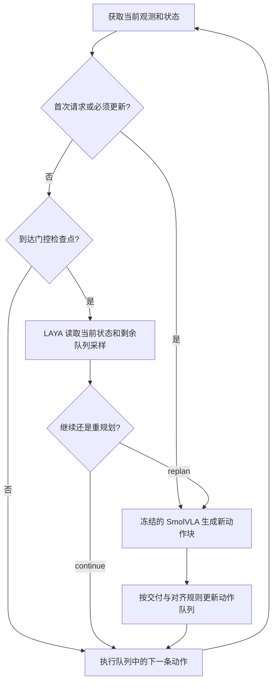

# 冻结 VLA 的长动作块与 LAYA 门控实验

本仓库记录一次机器人推理效率研究：**保持负责生成动作的 VLA 模型权重不变，让它一次输出更长的动作序列，再用一个轻量判断模型决定何时需要新的动作计划。** 实验关注任务成功率、模型调用次数，以及包含判断开销的推理服务耗时。

项目名 `jev-acc-vla` 沿用最初“用 Jev 尝试提高 VLA 推理效率”的研究方向。本仓库两轮实验实际使用 **SmolVLA 生成动作、LAYA 判断继续或重规划**。阅读方法和结果时，以文档记录的实际模型及控制规则为准。

仓库包含实验记录、方法协议、研究代码、配置、汇总结果、图表和核验材料。目前记录覆盖两轮实验及后续对照的实际完成范围。完整验证尚未证实这套门控能稳定兼顾成功率与费用优势；开发中的有利结果、负结果和未完成实验都保留在对应材料中。

## 1. 从什么问题开始

VLA（Vision–Language–Action，视觉—语言—动作模型）根据图像、任务指令和机器人状态输出控制动作。在本实验中，机械臂执行 LIBERO Spatial 的语言指令任务，VLA 每次输出一串动作，控制器逐步执行。

频繁运行 VLA 可以更及时地获得新计划，但模型服务开销会增加。减少请求则使机器人更长时间沿用已有计划，需要检查任务表现是否下降。

最初的设想有两个部分：

1. **扩大一次生成的动作量。** 将原生动作块长度从50步扩展为100或200步，使旧队列有更多可继续执行的动作。
2. **按状态决定更新时机。** 由LAYA判断当前计划是否还能继续，允许跳过部分VLA请求，并把LAYA自身的费用计入比较。

实验因此需要同时回答：模型能否生成长块？这些动作是否真的被执行？门控能否减少请求？减少请求后能否保持成功率？门控带来的收益是否超过它自己的开销？

## 2. 系统里各部分负责什么

| 部分 | 本实验中的职责 |
|---|---|
| SmolVLA | 接收观测和指令，生成新的动作块；基础权重冻结 |
| LAYA | 读取文本化的任务、状态和队列信息，判断 `continue` 或 `replan`；基础权重冻结 |
| 动作队列与控制器 | 保存未执行动作，决定请求、交付、替换队列和逐步执行的规则 |
| LIBERO Spatial | 提供机器人仿真、任务指令、观测、初态和任务成功判定 |
| 外部校准／线性读出 | 第二轮单独拟合的开发候选；选中的适配模型未进入正式闭环控制器 |

**冻结**指基础模型参数保持不变。运行时仍会重新执行前向推理，输入观测也会变化。第二轮拟合过外部适配组件，因此分别描述“基础模型冻结”和“开发阶段存在拟合”。

### 动作块、状态和观察的含义

- **动作块长度 `H`**：一次VLA请求返回的动作行数，取50、100、200。每行是7维控制命令，包含末端平移、旋转和夹爪控制。
- **原生长块**：一次推理直接返回 `H×7` 动作。100／200步是在训练长度50之外的推断长度外推，没有通过重复、插值或拼接短块得到。
- **剩余队列**：已有动作块中尚未执行的命令。生成200步不意味着机器人会连续执行全部200步，新计划可能提前替换它。
- **当前观察和状态**：VLA请求使用图像、任务指令和机器人状态。LAYA使用文本化的任务、当前末端／夹爪状态、对象位置、相对上次请求的位移、计划年龄和旧队列动作采样。
- **对象信息**：LAYA的对象坐标来自仿真器，属于特权状态。迁移到真实机器人时，还需要解决这些信息的获取问题。

文档中的 `task0` 是任务编号，`state0` 是该任务的初始状态编号；它们用来定位一次环境重置，并非某个状态向量的数值。`K5` 表示每5步刷新，`固定I45` 表示每个计划年龄达到45步时请求新块。这里的步数均指控制步。

### 如果不请求 VLA，机器人怎样继续

选择 `continue` 后，控制器按顺序执行旧队列中**尚未执行的动作**。当前环境仍推进，观测仍更新；在规定的门控检查点，LAYA会读取当前状态。检查点之间按既定调度执行，已有队列不会随每次新观测自动修改。

选择 `replan` 后，VLA读取对应请求的输入并生成新块。对于主门控策略，请求后继续消费旧队列 `d` 个逻辑步；新块接入时丢弃前 `d` 行并更新队列。VLASH式对照采用另一种输入和动作行对齐规则，见后面的对照表。

实验没有另行预测机器人未来物理状态。LAYA看到的动作窗口来自已经生成的队列，它判断这段计划是否可以继续使用。



图中概括门控闭环。具体检查间隔、强制更新和交付规则由各阶段的控制器定义决定。

## 3. 实验平台与共用设置

实验在单张RTX 4090 D上使用LIBERO Spatial的10个机器人操作任务（`task0–9`）。机械臂根据任务指令完成对象操作和空间关系目标，成功由环境判定。一个回合对应某方法在一个任务、一个初始状态下运行至成功或最多230个控制步。

| 项目 | 设置 |
|---|---|
| VLA检查点 | `HuggingFaceVLA/smolvla_libero` |
| VLA revision | `6721902bc4d61e50a3bfdb11dfb4cb626f05d102` |
| LAYA检查点 | `convaiinnovations/laya` |
| LAYA revision | `55cf4c4ebb4ebe31b2550e8bdf3bd21b99753851` |
| LAYA SDK | `0.3.22` |
| VLA推理设置 | 原加载路径混合BF16／FP32；噪声FP32；10次flow积分；RTC关闭 |
| 动作输出 | 一次直接输出50／100／200行，每行7维 |
| 参数检查 | eval、关闭参数梯度，核对运行前后参数指纹 |
| 配对比较 | 同批方法使用相同任务和初态，记录种子及执行顺序 |
| 交付延迟 | 主实验 `d=1`；后续单列 `d=4` 和 `d=5` |

**这里的 `d` 是控制器设置的逻辑交付延迟。** 仿真在模型推理期间暂停，实验并未实现让机器人与模型推理持续并行的真实异步运行。推理服务耗时和逻辑控制延迟分别记录。

## 4. 两轮实验为什么连续开展

第一轮先检查“长动作块＋门控”能否运行，并比较固定请求规则。它发现LAYA的概率都达不到预设门槛，实际退回基线调度。取消门槛后出现部分有利开发结果，也出现质量损失。

第二轮沿着这一问题开展诊断：检查输入格式和概率计算，比较二选项提示与动作窗口，开发有限跳过策略，再将选定策略与固定周期等对照放到配对验证中。另做真实请求／跳过分支，用于检验校准和外部读出候选。

| 阶段 | 要检查的问题 | 实际范围 |
|---|---|---|
| 第一轮：长块主比较 | 原生长块能否输出？不同更新规则表现如何？ | 360个主比较回合 |
| 第一轮：补充与参考 | 取消接受门槛后怎样？官方模型参考怎样？ | 90个消融、30个官方参考、12个pilot回合 |
| 第二轮：诊断与开发 | 低置信度是否来自格式／提示？如何降低门控频率？ | 780个新增开发闭环回合，离线判断另计 |
| 第二轮：分支与适配 | 同一决策点请求或跳过会产生什么后果？ | 564个机会、1128条实际分支 |
| 第二轮：完整验证 | 选定策略在配对起点、费用接近对照及不同延迟下表现如何？ | 1050＋600＋450＋450＝2550个方法／H回合 |
| 第二轮：未完成对照 | 状态、动作行和噪声的影响；与随机跳过比较 | 对齐组619条记录，其中420条作部分描述；随机组未启动 |

按阶段展开的实验log见[实验记录](docs/实验记录.md)，精确计数口径见[数据说明](docs/DATA.md)。

## 5. 第一轮：长动作块与更新规则

第一轮使用10个任务、`state0／1／2`，共30个已曝光的开发起点。每个 `H` 运行四种方法，主比较为 `30×3×4=360` 回合。

进入主比较前，先检查三种输出长度、数值有效性、同噪声重复输出及参数冻结，再做12回合小规模pilot检查实现和调度。pilot不进入主比较的成功率分母。

| 方法 | 请求和执行规则 | 比较目的 |
|---|---|---|
| Smol70 | 剩余动作数／H ≤ 0.7时请求新计划；首次约在执行0.3H后触发 | 原有按剩余队列触发的参考 |
| LAYA，τ=0.7 | 每5步判断；最高概率低于0.7时回退Smol70；队列接近耗尽时强制请求 | 检查带接受门槛的自适应请求 |
| 普通K5 | 每5步请求，使用请求点的图像和状态；交付时裁掉过期动作行 | 高频刷新对照 |
| 同模型VLASH式K5 | 每5步更新，使用较旧图像和实际预测点的当前机器人状态，从新块第0行执行 | 检查输入及动作行对齐机制 |

Smol70的“70%”表示**剩余比例**；H50／100／200的首次触发约为第15／30／60步。

首轮LAYA提示还含 `uncertain` 选项。主比较的3146次判断最高概率均低于0.7，应用门槛后全部回退，动作轨迹与Smol70配对一致，却增加了门控费用。随后登记并运行90回合消融，只取消接受门槛，保留原提示和调度。

三种原生输出长度均通过资格检查。追加消融的实际执行记录中，H100最远消费到第100行，H200最远消费到第200行，说明长块尾部确实参与过控制；这不表示每个回合都用完了整个长块。

取消门槛后，H50／100／200的成功数为18／13／15，各30回合。H50相对普通K5的成功数为18对16，服务耗时比为0.759；相对低频Smol70，其耗时仍为2.08倍。这组开发结果促使第二轮继续检查门控和调度，没有直接作为最终验证结论。

长块资格检查与实际执行记录保留在[首轮报告](长动作块补充实验/REPORT.md)及 `results/`。官方π0.5 VLASH另完成30回合参考，其模型、训练和批量执行不同，与同模型机制比较分开报告。

## 6. 第二轮：从概率诊断到主控制器

### 6.1 概率、输入与提示诊断

从保存轨迹抽取270条门控输入，比较六种表示／问题变体，另加人工语义控制，合计1680次离线判断。诊断检查了数字序列化、输入截断、logits、温度缩放和SDK返回概率。

发现float32数字转文本后保留了过多小数位。修复为三位小数后，输入token约减少19%，但仍不能可靠超过0.7。扩大提示预算没有改变结果，因为相关输入没有被截断。后续改用严格 `continue／replan` 二选项argmax，即选择两者概率中较大的一个。

长版二选项虽然部分概率较高，却在保存输入和对应闭环试验中全部选择继续，因此继续开发短版、紧凑版和动作窗口。还做了交换选项顺序的离线诊断，相关集成候选未部署。

具体变体、概率范围与开销见[诊断记录](LAYA阈值诊断与优化/DIAGNOSIS.md)和实验记录第4部分。

### 6.2 输入、检查频率和有限跳过

在旧 `state0–2` 上，开发共新增780个闭环回合：表示80、检查调度120、补确认160、单次跳过120、固定周期160、单次跳过补确认140。复用的对照回合单独标明，不重复计入新增量。

最终主候选为 `window3_skip1`：基础LAYA的二选项argmax、三个旧队列动作位置组成的输入窗口，以及每个计划最多跳过一次请求。

| H | 门控检查年龄I=0.3H | 选择replan | 选择continue |
|---:|---:|---|---|
| 50 |15步|在15步请求|在30步强制请求|
| 100 |30步|在30步请求|在60步强制请求|
| 200 |60步|在60步请求|在120步强制请求|

年龄从该动作块的请求点计算。选择继续后，在 `I` 与 `2I` 之间不再次问LAYA；请求后按 `d` 的交付规则接入新块，队列接近耗尽时有强制更新。

窗口覆盖接下来至下一次检查及交付所需的旧动作，长度为 `L=min(剩余动作数,I+d)`。三个样本是该窗口的首、中、末位置，包含平移和夹爪命令，并保留当前任务和状态信息。它们来自已生成动作队列，没有三次投票或未来物理状态预测。三种H共用同一控制规则，正式验证前冻结候选与配置。详见[单次跳过协议](LAYA阈值诊断与优化/SINGLE_SKIP_PROTOCOL.md)和[主候选定义](LAYA阈值诊断与优化/VALIDATION_SELECTION_D1.md)。

### 6.3 请求／跳过的真实分支与外部适配

从基线非初始请求点恢复同一物理状态、控制器状态及随机状态，分别实际运行“现在请求”和“跳过一次”两条后续轨迹。分支结果用于形成请求必要性和效用标签，未来结果不进入LAYA输入。

共564个决策机会、1128条分支，按 `state0` 拟合、`state1` 选择、`state2` 冻结后诊断分组。外部校准和线性读出在这里拟合；按原开发规则选出的四种适配读出，在state2的18个重规划标签上召回均为0/18，未进入正式闭环部署。

正式主候选仍使用基础LAYA的二选项argmax。详细标签、分组和其他读出实验见[反事实协议](LAYA阈值诊断与优化/COUNTERFACTUAL_PROTOCOL.md)、[校准协议](LAYA阈值诊断与优化/CALIBRATION_PROTOCOL.md)和第二轮报告。

## 7. 完整验证如何安排

开发结束后保持主候选不变，在未参与本轮候选选择的初态上做配对比较。这些是公开初态，不能据此断言整个历史项目从未使用过它们。

| 完整验证组 | 起点与回合数 | 主要目的 |
|---|---|---|
| d=1主验证 | task0–9、state10–14；21个方法／H单元×50起点＝1050回合 | 比较主LAYA、Smol70、固定I45、普通K5、同模型VLASH式K5及输入／调度消融 |
| 费用接近固定周期 | task0–9、state20–24；4方法×3H×50起点＝600回合 | 区分按状态选择与单纯降低请求频率的收益 |
| d=4逻辑延迟 | task0–9、state30–32；5方法×3H×30起点＝450回合 | 检查增加逻辑交付延迟后的表现 |
| d=5逻辑延迟 | 与d=4相同起点；另450回合 | 保留另一预登记延迟条件，不择优报告 |

费用接近组的固定周期I19／I38／I71，仅依据开发费用预先选择，分别对应H50／100／200；验证后不重新调周期。实际回合长度会变化，因此报告实测费用，不保证两方法费用完全相等。

### 主验证的读数示例

下表每种方法／H均为50个配对起点，服务秒为这50回合的累计值。完整方法表和描述性区间见[完整验证数值表](LAYA阈值诊断与优化/analysis/VALIDATION_READOUT.md)。

| H | Smol70成功 | 主LAYA成功 | VLA调用：Smol70→LAYA | 服务秒：Smol70→LAYA | LAYA／Smol70费用比 |
|---:|---:|---:|---:|---:|---:|
| 50 |32/50|26/50|526→428|102.832→92.572|0.900|
| 100 |20/50|18/50|321→260|62.618→56.017|0.895|
| 200 |17/50|16/50|169→157|33.200→33.507|1.009|

这组读数显示请求数减少，但成功数也有下降；H200加入门控费用后总费用没有降低。主比较的费用比描述性区间均跨1，不能仅凭点值将其写成稳定的整体提升。

费用接近组中，主LAYA成功数为26／24／17，对应固定周期为24／20／17，各50回合；费用比为0.974／1.022／1.031。三个成功差描述性区间均包含零。

d4和d5各自完整报告，它们共用起点。某些配置呈现有利点值，但各长度和延迟的结果存在变化，详见实验记录及完整数值表。

## 8. 未完成对照记录到哪里

**输入、动作行与噪声对齐组**原计划630回合。它为普通K5和VLASH式K5补充控制，尝试分别检查机器人状态时效、执行起始动作行和噪声种子映射的影响。

实际保存619条记录：state42、40两个完整分片共420条，通过审计并纳入部分描述；state41中止分片199条单列，缺少结束时权重指纹与整片审计，未纳入配对表。部分结果只报告既定点值，没有新增区间、正式机制归因或候选晋升。

**随机跳过组**原计划450回合，正式组及资格计划均未启动。它的设想是保留相同单次跳过规则，以开发时的继续频率随机决策，不读取当前状态也不调用LAYA。本仓库保留其协议与代码，尚无这项对照的效果结果。

计划、代码或少量记录不能代替完整确认。实际覆盖与遗漏分片见[部分样本读数](LAYA阈值诊断与优化/analysis/PARTIAL_SAMPLE_READOUT.md)、[部分样本协议](LAYA阈值诊断与优化/PARTIAL_SAMPLE_REPORTING.md)和[运行清单](LAYA阈值诊断与优化/analysis/run_inventory.md)。

## 9. 怎样理解表里的指标

| 指标 | 阅读方式 |
|---|---|
| 成功数／n | 在该方法／H的n个完整回合中，环境判定成功的数量 |
| 配对胜／负 | 相同任务和初态上，候选独自成功／参照独自成功的回合数；相同成功总数仍可能有不同胜负 |
| VLA调用数 | 实际请求生成新动作块的次数 |
| LAYA调用数 | 实际门控判断次数；离线诊断另计 |
| 总服务秒 | 累计VLA同步服务时间＋门控端到端时间；门控包含主机处理、同步及IPC |
| 费用比 | 候选累计总服务秒／参照累计总服务秒；小于1表示该口径下候选耗时较少 |
| 95%描述性区间 | 完整验证按登记的任务＋初态分层配对bootstrap计算；解释需结合样本与统计协议 |
| 回合／分支／判断 | 不同记录单位，不能相加为独立测试起点数 |

这里的“费用”是指定口径下的推理服务时间。模拟器推进、写盘、启动、资格检查和warmup另记。成功更快或失败后执行到上限，会影响整条轨迹的请求数，因此同时报告成功、累计费用和配对比较。

完整验证2550回合包含同一初态上的不同方法和H，d4／d5还复用同一批起点。仿真推理期间暂停，门控使用特权对象信息，现有服务秒不能直接换算成真实异步机器人的加速倍数。

## 10. 仓库目录与阅读入口

```text
.
├── README.md                       # 研究背景、系统、实验设计和阅读入口
├── EXPORT_MANIFEST.json            # 本发布版文件指纹
├── docs/
│   ├── 实验记录.md                   # 按实验批次展开的主要log
│   └── DATA.md                      # 样本口径、发布范围与复查条件
├── 长动作块补充实验/
│   ├── REPORT.md / PLAN.md          # 首轮结果与设计
│   ├── scripts/                    # 执行、分析、绘图及核验代码
│   ├── results/ / figures/          # 汇总结果与图表
│   ├── verification/               # 首轮核验材料
│   ├── source_snapshot/            # 相关上游源码快照
│   └── raw/README.md                # 原始数据未发布的说明
└── LAYA阈值诊断与优化/
    ├── REPORT.md / REPRODUCE.md     # 第二轮结果与证据链说明
    ├── scripts/                    # 门控、调度、分支、适配和统计代码
    ├── analysis/ / figures/         # 汇总、完整验证及部分样本结果
    ├── configs/ / protocol/         # 运行配置、冻结定义和统计协议
    ├── checks/                     # 核验结果与历史文件指纹
    ├── models/                     # 小型外部校准／线性读出JSON
    ├── source_snapshot/ / evidence/ # 源码与版本证据
    ├── artifacts/                  # 小型归档收据，完整归档未发布
    └── raw/README.md                # 原始数据未发布的说明
```

### 推荐阅读顺序

1. **先理解整个实验**：本README，再读[实验记录](docs/实验记录.md)。后者展开每批改了什么、运行多少、观察到什么。
2. **追第一轮问题来源**：读[首轮报告](长动作块补充实验/REPORT.md)及[首轮计划](长动作块补充实验/PLAN.md)。
3. **追第二轮策略如何形成**：读[第二轮报告](LAYA阈值诊断与优化/REPORT.md)，结合诊断、单次跳过和校准协议。
4. **查精确数字**：读[完整数值表](LAYA阈值诊断与优化/analysis/VALIDATION_READOUT.md)、[部分样本表](LAYA阈值诊断与优化/analysis/PARTIAL_SAMPLE_READOUT.md)，再定位对应JSON。
5. **核对证据或准备重跑**：读[运行清单](LAYA阈值诊断与优化/analysis/run_inventory.md)、[数据说明](docs/DATA.md)和[复查说明](LAYA阈值诊断与优化/REPRODUCE.md)。

### 如果从代码入手

| 想了解什么 | 入口 |
|---|---|
| 首轮VLA推理与动作队列 | [main_experiment.py](长动作块补充实验/scripts/main_experiment.py) |
| 二选项输入、提示与门控服务 | [gate_variants.py](LAYA阈值诊断与优化/scripts/gate_variants.py)、[binary_service.py](LAYA阈值诊断与优化/scripts/binary_service.py) |
| 调度、单次跳过与动作窗口 | [controller_runtime.py](LAYA阈值诊断与优化/scripts/controller_runtime.py)、[window_state.py](LAYA阈值诊断与优化/scripts/window_state.py)；后续执行包装见 [verified_runtime.py](LAYA阈值诊断与优化/scripts/verified_runtime.py) |
| 分片与正式运行编排 | [run_frozen_cohort.py](LAYA阈值诊断与优化/scripts/run_frozen_cohort.py)及对应 `configs/`、`protocol/` |
| 真实请求／跳过分支 | [collect_gate_counterfactuals.py](LAYA阈值诊断与优化/scripts/collect_gate_counterfactuals.py) |
| 完整验证与费用统计 | [analyze_validation_cohort.py](LAYA阈值诊断与优化/scripts/analyze_validation_cohort.py)、[analyze_service_accounting_v2.py](LAYA阈值诊断与优化/scripts/analyze_service_accounting_v2.py) |
| 部分样本的纳入规则 | [analyze_partial_sample.py](LAYA阈值诊断与优化/scripts/analyze_partial_sample.py) |

## 11. 数据范围、复查与重新执行

本仓库发布两轮实验的文档、代码、配置、汇总结果、图表和精选核验记录。`models/`包含外部校准／读出参数，基础SmolVLA和LAYA权重需另行获取。

逐回合动作、预测块、完整物理状态、门控输入、反事实分支原件、完整压缩归档、运行环境与大模型权重未随仓库发布。`raw/`只有说明文件，也没有原始归档的自动下载入口。

| 工作 | 本仓库能提供的支持 |
|---|---|
| 理解设计和控制规则 | 阅读README、实验记录、协议、配置与代码 |
| 核对已报告数字和完成范围 | 查汇总JSON、表格、图表和运行清单 |
| 逐动作来源审计、重算反事实标签 | 还需要未发布的逐回合原件，summary不足以重建 |
| 完整重跑分析 | 需要原件，并按脚本预期布置输入和依赖 |
| GPU闭环复现 | 需要模型、LIBERO资源、原环境依赖及服务配置，重新冻结代码和配置并通过资格检查 |

代码按研究快照提供，包含原研究环境的路径和依赖约定，尚未整理成一键安装运行的软件包。准备新运行时，应使用独立输出目录，配置所需路径和依赖，检查输入及输出形状，并重新产生自己的冻结与资格记录。

`EXPORT_MANIFEST.json`记录**本发布版**文件的SHA256。实验收据中的模型、源码和归档SHA对应**原实验执行材料**。发布时整理过路径和说明，历史指纹仍用于追溯原运行，不能直接充当发布代码新运行的冻结收据；持有原件时才能进行相应字节核对。

上游源码快照保留相关许可声明，使用这些内容时遵循各自原有许可。更多数据范围和复查条件见[DATA.md](docs/DATA.md)。
