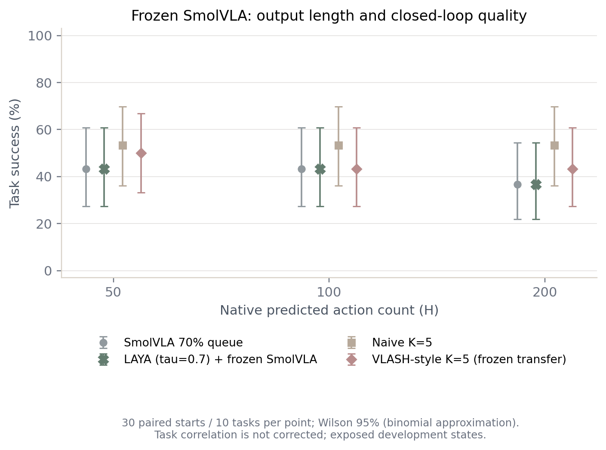
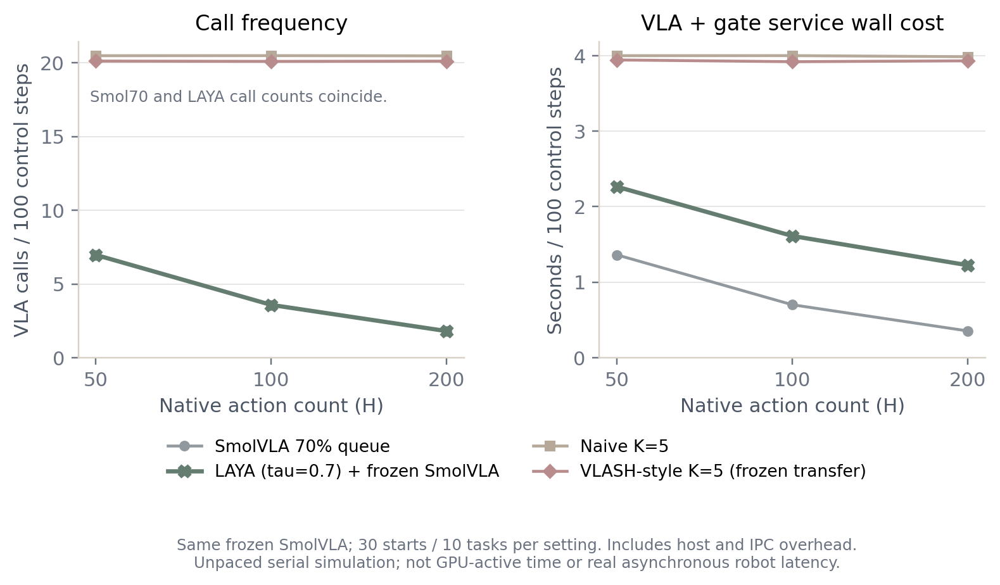

# 冻结 VLA 的长动作块与 LAYA 调度：独立补充实验报告

**状态：实验与原件审计已完成。** 远端 RTX 4090 D 上完成360个主比较回合、90个原始选择消融回合、30个官方VLASH参考回合，以及12个单列pilot回合，共492回合。主比较和消融复用30个初始状态，回合数量不代表492个独立初始状态。

**结论。** 已验证冻结SmolVLA可以原生生成100/200步动作，但本次没有证实“加长动作块＋当前LAYA门控”能稳定提高效率。τ=0.7全部弃权并增加费用；直接使用原始选择后，H50/100/200成功为18/13/15，H100/200相对H50费用仅下降1.3%/2.5%，同时净少5/3个成功。较值得继续验证的是H50原始门控：相对普通K5，观察到18/30对16/30成功、含门控费用低24.1%；相对低频Smol70，费用仍为2.08倍。这是已曝光开发起点上的探索性质量/费用权衡，尚未证明稳健优势。

## 1. 主要结果

冻结检查点能够原生输出50×7、100×7、200×7动作，运行前后参数指纹一致。100/200属于原训练长度50之外的推断长度外推；没有重复、插值或拼接50步输出，也没有微调VLA。

保守门控下，LAYA的3146次正式判断的最高类别概率全部低于τ=0.7接受门槛（范围0.4355–0.5599），因而退回Smol70。原始最高概率选择分布为{'replan': 1877, 'continue': 1269}，不能说模型原始输出只有uncertain。

| 原生输出 H | Smol70 成功 | LAYA τ=0.7 成功 | LAYA τ=0 探索消融成功 | 普通 K=5 成功 | VLASH式输入对齐成功 |
|---:|---:|---:|---:|---:|---:|
| 50 | 13/30 (43.3%) | 13/30 (43.3%) | 18/30 (60.0%) | 16/30 (53.3%) | 15/30 (50.0%) |
| 100 | 13/30 (43.3%) | 13/30 (43.3%) | 13/30 (43.3%) | 16/30 (53.3%) | 13/30 (43.3%) |
| 200 | 11/30 (36.7%) | 11/30 (36.7%) | 15/30 (50.0%) | 16/30 (53.3%) | 13/30 (43.3%) |

官方训练后的VLASH π0.5参考：**30/30 = 100.0%**，H50/K5/d1。它使用不同模型与训练，单列为参考，不能把跨模型分数差解释成LAYA或调度策略的因果效果。

图1：同一冻结SmolVLA的主比较，每格30个配对起点，误差条为按n=30二项近似计算的Wilson 95%区间，未校正同一任务内三个起点的相关性，仅作描述，不能视为泛化置信度。原始选择消融在后文单列。

## 2. 实验设计

| 项目 | 本次设置 |
|---|---|
| 设备 | 单张RTX 4090 D；与原有无关作业共享，未中断该作业；不使用本机GPU |
| VLA | HuggingFaceVLA/smolvla_libero@6721902bc4d61e50a3bfdb11dfb4cb626f05d102 |
| 冻结 | eval、全部requires_grad=False、无优化器/训练步；前后完整参数/状态指纹核对 |
| 精度 | 原加载路径混合dtype：600,902,304个BF16参数、4,031,872个FP32参数；噪声FP32 |
| 生成 | H=50/100/200，真实完整H行；每请求10次flow积分，RTC关闭 |
| 数据 | LIBERO Spatial 10任务×初态0/1/2，共30个已经曝光的开发起点 |
| 回合 | 最多230控制步；同任务/起点配对，固定噪声种子规则；主实验各配置顺序打乱 |
| LAYA | convaiinnovations/laya固定检查点，SDK0.3.22；冻结；每5步检查 |
| 门控输入 | 英语任务、计划时/当前对象坐标、当前机器人状态、已有队列的动作采样；对象坐标来自仿真特权状态 |
| 输入预算 | 1536 tokens，逐次核验无截断、选项无碰撞、无CPU回退；prompt固定 |
| 执行器 | 推理与控制串行，仿真在推理时暂停；d=1只是逻辑交付/图像延迟 |

**Smol70的定义。** 采用当前官方客户端的`remaining/H <= 0.7`规则，即剩余量低于或等于70%时请求，H50/100/200首次分别在约15/30/60步触发；并非执行70%后才规划。新动作按请求时间戳裁掉已过期的一行并覆盖旧队列重叠区。本次明确命名为Smol70调度对照，没有声称复现原论文所有聚合和近重复状态过滤选项。[SmolVLA原文](https://arxiv.org/html/2506.01844v1)、[官方客户端](https://github.com/huggingface/lerobot/blob/main/src/lerobot/async_inference/robot_client.py)。

**LAYA主比较。** τ=0.7时，replan触发VLA，continue继续已有动作，不确定则回到Smol70时机；队列即将耗尽时强制续接。除触发决策外，它与Smol70共用生成、延迟、队列和噪声逻辑。

**两个K5对照。** 普通K5采用陈旧图像/状态与动作时间戳裁剪；VLASH式输入对齐采用前一控制步图像与真实当前机器人状态，新动作直接从第0行执行。完整VLASH依赖offset训练；本次冻结SmolVLA只迁移其输入对齐机制，没有做该训练，也没有执行真实异步未来状态预测。[VLASH原文](https://arxiv.org/html/2512.01031v2)、[固定官方代码](https://github.com/mit-han-lab/vlash/blob/d2da223e2251a4a5020b667e77cf8ad57e594144/vlash/eval_libero.py)。

固定230步截断时，普通K5在第229步已经付费预测，通常共47次；VLASH式此时只缓存图像，下一次预测没有执行，通常共46次。已付但未交付的预测仍计入成本；这一差别含终止边界效应，不能解释成完整VLASH额外计算加速。

H变化时，Smol70的重规划间隔也随之改变。K5保持5步刷新，帮助观察固定刷新间隔下的输出长度变化；不能把Smol70跨H差异全部归因于输出长度本身。

## 3. 主比较：质量与实测费用

| H | 方法 | 成功/30 | VLA调用总数 | 调用/100步 | VLA秒 | 门控秒 | VLA+门控秒/100步 |
|---:|---|---:|---:|---:|---:|---:|---:|
| 50 | Smol70 剩余量阈值 | 13/30 | 362 | 6.97 | 70.73 | 0.00 | 1.36 |
| 50 | LAYA，τ=0.7 | 13/30 | 362 | 6.97 | 72.56 | 45.00 | 2.26 |
| 50 | 普通 K=5 | 16/30 | 991 | 20.48 | 193.55 | 0.00 | 4.00 |
| 50 | VLASH式输入对齐，K=5 | 15/30 | 1005 | 20.11 | 197.02 | 0.00 | 3.94 |
| 100 | Smol70 剩余量阈值 | 13/30 | 191 | 3.58 | 37.40 | 0.00 | 0.70 |
| 100 | LAYA，τ=0.7 | 13/30 | 191 | 3.58 | 38.18 | 47.75 | 1.61 |
| 100 | 普通 K=5 | 16/30 | 1007 | 20.48 | 196.67 | 0.00 | 4.00 |
| 100 | VLASH式输入对齐，K=5 | 13/30 | 1061 | 20.09 | 206.98 | 0.00 | 3.92 |
| 200 | Smol70 剩余量阈值 | 11/30 | 101 | 1.81 | 19.85 | 0.00 | 0.36 |
| 200 | LAYA，τ=0.7 | 11/30 | 101 | 1.81 | 20.36 | 48.11 | 1.23 |
| 200 | 普通 K=5 | 16/30 | 1003 | 20.47 | 195.32 | 0.00 | 3.99 |
| 200 | VLASH式输入对齐，K=5 | 13/30 | 1053 | 20.11 | 205.86 | 0.00 | 3.93 |

图2：调用密度与VLA+门控的串行服务墙钟费用。每100步标准化不代表任务质量相同，必须联合图1及成功率阅读；这些数字不是GPU活跃秒或真实异步机器人速度。

| H | LAYA/Smol70调用比 | LAYA/Smol70推理费用比 [任务簇95%区间] | 仅LAYA成功 / 仅Smol70成功 | 弃权时逐动作一致配对 |
|---:|---:|---:|---:|---:|
| 50 | 1.00 | 1.66 [1.58, 1.75] | 0 / 0 | 30/30 |
| 100 | 1.00 | 2.30 [2.09, 2.52] | 0 / 0 | 30/30 |
| 200 | 1.00 | 3.45 [3.09, 3.86] | 0 / 0 | 30/30 |

费用比小于1才表示本次测得费用减少；区间使用10个任务簇配对重采样10,000次，不足以证明2个百分点非劣。调用、费用和质量分别统计，不用调用节省代替加速。

**输出长度设置的配对比较。** 以相同初态的H50为参照，下面单列Smol70；其余调度与τ=0探索消融的全部比较见[跨长度分析](results/horizon_effects.md)。

| Smol70比较 | 仅长块成功 / 仅H50成功 | 调用比 | 推理费用比 [任务簇95%] | 平均每回合控制步变化 |
|---|---:|---:|---:|---:|
| H100 / H50 | 3 / 3 | 0.53 | 0.53 [0.48, 0.58] | +4.57 |
| H200 / H50 | 4 / 6 | 0.28 | 0.28 [0.25, 0.32] | +13.23 |

Smol70的H100与H50成功总数相同，但发生3个成功得益、3个成功损失，不能据总数持平声称质量无损。H200比H50净少2个成功。这里H增加同时让70%规则更晚刷新，费用下降属于“长度＋刷新周期”的联合设置；固定K5结果没有显示加长自动提升成功率。

## 4. 探索性消融：直接使用LAYA原始选择

该消融在pilot揭示τ=0.7全部弃权后登记，发生在其自身运行之前。固定同一prompt与同一VLA，只将置信度门槛改为0，采用原始argmax；原始语义选项uncertain仍允许回退。共90回合，无阈值搜索或再训练。这是开发阶段消融，不能称为独立确认集。

实际决策分布：{'replan': 1446, 'continue': 1452}。

| H | 成功/30 | VLA调用 | 门控判断 | VLA+门控秒 | 相对Smol70费用比 [95%] | 配对成功净增 |
|---:|---:|---:|---:|---:|---:|---:|
| 50 | 18/30 | 541 | 932 | 146.95 | 2.08 [1.59, 2.62] | +5 |
| 100 | 13/30 | 520 | 1007 | 145.00 | 3.88 [2.87, 4.99] | +0 |
| 200 | 15/30 | 517 | 959 | 143.31 | 7.22 [5.29, 9.43] | +4 |

与普通K5和VLASH式输入对齐的全部配对比较保存在[消融摘要](results/argmax/argmax_summary.md)。H50原始门控相对普通K5的服务费用比为0.759，成功18/30对16/30，配对为5个得益、3个损失；这一观察提示一种可继续验证的质量/费用权衡。H100原始门控为13/30，低于普通K5的16/30；H200为15/30对16/30。不能只用费用下降得出整体优越结论。消融晚于主试验顺序执行，共享GPU负载变化也是跨阶段计时的限制。

在原始门控内部，H100/H200对H50的服务费用比分别为0.987/0.975，任务簇95%区间为[0.835,1.223]/[0.882,1.067]，同时成功净少5/3个；因此本次数据未显示加长能带来可靠的额外费用收益。

**长块实际用到了哪里。** 下表行索引从1开始，51/101行计数均含该边界。原生生成200行不能单独证明第101至200行具有闭环控制能力，必须看实际执行覆盖。

| H | 调度 | 已执行最大生成行 | 执行第51行及以后 | 执行第101行及以后 | 生成行利用率 | 每块平均执行行数 |
|---:|---|---:|---:|---:|---:|---:|
| 50 | Smol70 | 16 | 0 | 0 | 28.7% | 14.34 |
| 50 | LAYA τ=0探索消融 | 50 | 0 | 0 | 17.7% | 8.84 |
| 100 | Smol70 | 31 | 0 | 0 | 27.9% | 27.90 |
| 100 | LAYA τ=0探索消融 | 100 | 706 | 0 | 9.9% | 9.93 |
| 200 | Smol70 | 61 | 797 | 0 | 27.7% | 55.34 |
| 200 | LAYA τ=0探索消融 | 200 | 610 | 317 | 4.8% | 9.51 |

每块平均值及利用率的分母包含已经付费预测、但回合结束前未接入的块。全部5种调度的覆盖、10任务细分与失败回合原件索引见[任务层诊断](results/task_breakdown.md)；失败记录只描述可观察事件，没有把个别门控决策标注为失败原因。

## 5. 官方VLASH参考

固定作者检查点`mit-han-lab/vlash-pi05-libero-async5@c85d5962a7b823f9f391f97d60227d6ca8bd7bc7`，源码`d2da223e2251a4a5020b667e77cf8ad57e594144`；H50、K5、d1，seed42，官方10环境批量。新30回合结果30/30，严格终止统计与官方mask分歧0个，冻结前后指纹一致。

本次官方评估墙钟75.53秒，实际批量预测80次、累计800个batch元素。已结束环境仍可能随批量计算，因此不能把批量调用数或墙钟直接同单环境SmolVLA的单次调用数比较。

从3份原始向量轨迹独立重算得到3049个严格有效控制步，同步预测墙钟合计50.32秒。实际覆盖每个任务的初态ID0/1/2，与Smol实验名义ID一致；官方原件未保留初始物理快照，且两套封装的reset路径不同，未验证逐bit物理配对。成功、步数、初态覆盖、预测记录与前后冻结清单共3046项核验通过，见[官方参考独立审计与每任务结果](results/official/summary.md)。

历史项目另有官方检查点四套件1944/2000=97.2%的已核验记录；它不是本次新实验，也没有被并入本次分母。原文表格检查点身份及采样对应关系仍未唯一证明。[历史复现报告](references/HISTORICAL_VLASH_REPORT.md)。

## 6. 计时、完整性与边界

| H | Smol70平均每次VLA毫秒 | τ=0.7平均每次完整门控毫秒 |
|---:|---:|---:|
| 50 | 195.39 | 44.43 |
| 100 | 195.82 | 45.83 |
| 200 | 196.52 | 44.10 |

两个受监督运行累计墙钟66.97分钟，包括模型加载、回合重置、运行中归档及监督等待；不包括前期代码准备、本地分析和报告制作。

VLA计时覆盖观测预处理、传输、模型、后处理与同步；门控计时覆盖状态文本构造、IPC和LAYA响应。`episode_wall_seconds`是包含首轮推理和运行中块保存的闭环主体时间，不含回合前置reset/settle、末尾归档和close；它已包含VLA与门控费用，不能再相加。

实测模型耗时不能由逻辑d=1替代。本次仿真没有按20Hz墙钟推进，也没有让模型与控制真实并行；不能据此宣称真实机器人响应加速或已满足50ms交付。

在相同控制轨迹和步数下，门控要有净收益，需满足“节省的VLA调用数×每次VLA费用 > 门控次数×每次门控费用”。长块会降低70%基线的调用频率，但固定每5步一次的门控频率不会随之降低，因此必须显式计入门控，不能只看VLA调用下降。

本次τ=0.7的同轨迹结果中，H100门控本身耗时47.75秒，已经超过Smol70全部VLA费用37.40秒；H200对应48.11对19.85秒。因此，若控制轨迹、门控次数和单次费用不变，单靠减少VLA调用不可能在这两组抵消现有门控费用。改变调度后可能改变成功时刻和步数，此比较不替代实际消融结果。

原始动作/行号/块来源、初态配对、H形状、NFE、门控概率与费用逐项审计：主试验366208项，消融102334项，错误均为0。完整数据与脚本、日志和指纹随报告保留。

其余限制：H100/200未经长时域训练；30个起点来自10任务且已曝光；LAYA接收仿真特权对象坐标，未计入真实视觉提取这些坐标的费用；τ=0.7与prompt未在当前机器人分布校准；同模型VLASH式对照没有offset训练；官方π0.5参考存在模型/训练/批量差异。单个模型和固定prompt的结果不能外推为整个门控方向不可行。

后续建议：优先在独立起点验证H50原始门控的观察，并用分离的校准集确定接受门槛；若继续长块方向，应同时研究更低频或更便宜的门控，以及经过长时域训练的动作尾部。以上为下一轮研究建议，本次没有据结果继续搜索阈值、重训或追加筛选样本。

## 7. 可复查材料

- [主指标CSV](results/main/metrics.csv) · [主指标JSON](results/main/metrics.json) · [主原件审计](results/main/audit.json)
- [原始选择消融指标](results/argmax/argmax_metrics.json) · [消融原件审计](results/argmax/argmax_audit.json)
- [任务层成功、门控与动作行覆盖](results/task_breakdown.md)
- [跨长度配对质量与费用](results/horizon_effects.md)
- 官方VLASH新结果（未随仓库提供；见数据说明）
- [官方VLASH原件独立审计](results/official/audit.json)
- [原主计划](PLAN.md) · [消融预登记](ARGMAX_PLAN.md) · [原文算法核对](BASELINE_AUDIT.md)
- [主源码审查](SOURCE_REVIEW.md) · [真实pilot审计](PILOT_RUNTIME_AUDIT.md) · [消融源码审查](ARGMAX_SOURCE_REVIEW.md)
- [主实验完整原件独立审计](FINAL_RUNTIME_REVIEW.md)
- [原始选择消融完整原件独立审计](ARGMAX_RUNTIME_REVIEW.md)
- [主归档SHA256与同步证明](archives/attempt_v1_complete.proof.json) · [消融归档SHA256与同步证明](archives/argmax_attempt_v1_complete.proof.json)
- [生成与执行脚本](scripts/main_experiment.py) · [指标分析脚本](scripts/analyze_results.py) · [图表脚本](scripts/plot_results.py)
- 图1/图2的SVG与PNG在`figures/`；完整本地原件在`raw/`。

远端唯一结果根：`/mnt/4t/jev_vla_libero/experiments/long_chunk_laya`。主实验`attempt_v1`，探索性消融`argmax_attempt_v1`。
